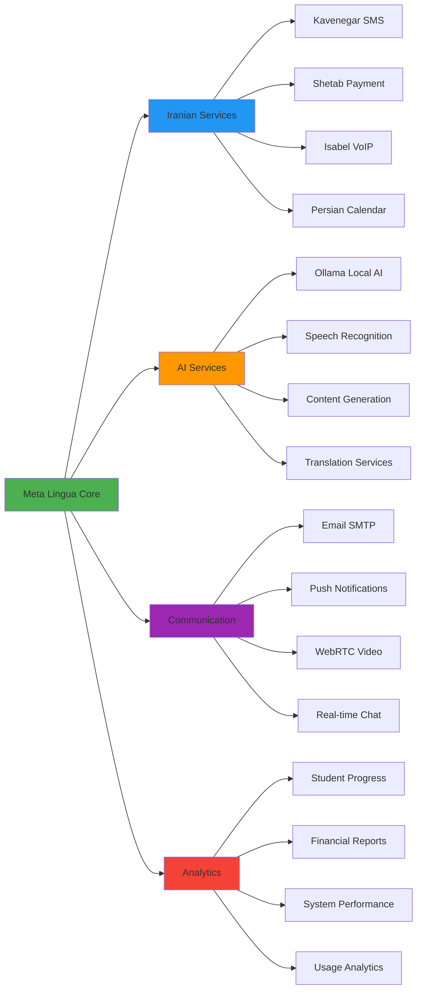

# Meta Lingua Platform - Complete Buyer's Manual

## Table of Contents
1. [Platform Overview](#platform-overview)
2. [User Roles and Access](#user-roles-and-access)
3. [Student Management System](#student-management-system)
4. [Teacher Management System](#teacher-management-system)
5. [Course Management](#course-management)
6. [Callern Video Tutoring System](#callern-video-tutoring-system)
7. [Administrative Features](#administrative-features)
8. [Financial Management](#financial-management)
9. [Communication Systems](#communication-systems)
10. [AI-Powered Features](#ai-powered-features)
11. [Gamification System](#gamification-system)
12. [Mobile Features](#mobile-features)
13. [White-Label Customization](#white-label-customization)
14. [Reporting and Analytics](#reporting-and-analytics)
15. [Integration Capabilities](#integration-capabilities)
16. [Troubleshooting Guide](#troubleshooting-guide)

---

## 1. Platform Overview

### What is Meta Lingua?
Meta Lingua is a comprehensive AI-enhanced multilingual language learning and institute management platform designed specifically for self-hosting in Iran with zero external dependencies. It combines traditional language institute management with modern AI-powered learning technologies.

### Key Benefits
- **Complete Self-Hosting**: No dependency on blocked services
- **Iranian Market Optimized**: Supports Shetab payments, Kavenegar SMS, Persian calendar
- **AI-Powered Learning**: Local Ollama integration for personalized education
- **Multilingual Support**: Teaches any language with RTL/LTR support
- **Comprehensive Management**: Full institute operations in one platform
- **White-Label Ready**: Multi-tenant architecture for resellers

### Core Components
1. **Learning Management System (LMS)**
2. **Video Tutoring Service (Callern)**
3. **Student Information System (SIS)**
4. **Teacher Management**
5. **Financial Management**
6. **Communication Center**
7. **AI Services**
8. **Gamification Engine**

---

## 2. User Roles and Access

### Overview of 7 User Roles

#### 1. **Admin** (مدیر سیستم)
**Primary Functions**: Complete system control and configuration
**Access Level**: Full platform access

**Key Responsibilities**:
- System configuration and branding
- User management and role assignment
- Course and curriculum design
- Financial oversight
- AI services management
- Integration configuration

**Main Dashboard Features**:
- System health monitoring
- User analytics
- Revenue reports
- Configuration panels
- Backup management

#### 2. **Teacher/Tutor** (معلم/مربی)
**Primary Functions**: Direct instruction and content delivery
**Access Level**: Teaching tools and student management

**Key Responsibilities**:
- Conduct classes (online/offline)
- Provide Callern video tutoring
- Create and grade assignments
- Track student progress
- Generate lesson plans

**Main Dashboard Features**:
- Class schedule and management
- Student roster and progress
- Callern availability toggle
- Resource library
- Payment tracking

#### 3. **Student** (دانش‌آموز)
**Primary Functions**: Learning and course participation
**Access Level**: Learning resources and progress tracking

**Key Responsibilities**:
- Attend classes and sessions
- Complete assignments and tests
- Use Callern for practice
- Track learning progress
- Participate in games

**Main Dashboard Features**:
- Course progress visualization
- Upcoming sessions
- Homework assignments
- Callern marketplace
- Wallet and payments

#### 4. **Mentor** (منتور)
**Primary Functions**: Student guidance and support
**Access Level**: Student progress monitoring and guidance tools

**Key Responsibilities**:
- Monitor student progress
- Provide academic guidance
- Support struggling students
- Coordinate with teachers
- Track learning milestones

**Main Dashboard Features**:
- Assigned students overview
- Progress analytics
- Intervention recommendations
- Communication tools
- Success metrics

#### 5. **Supervisor** (سرپرست)
**Primary Functions**: Quality assurance and oversight
**Access Level**: Teacher evaluation and quality monitoring

**Key Responsibilities**:
- Observe and evaluate teachers
- Monitor class quality
- Ensure curriculum compliance
- Generate performance reports
- Recommend improvements

**Main Dashboard Features**:
- Teacher performance metrics
- Class observation tools
- Quality reports
- Compliance monitoring
- Training recommendations

#### 6. **Call Center Agent** (پشتیبان)
**Primary Functions**: Customer service and lead management
**Access Level**: CRM tools and communication systems

**Key Responsibilities**:
- Handle incoming inquiries
- Manage lead pipeline
- Process enrollments
- Provide customer support
- Track conversion metrics

**Main Dashboard Features**:
- Unified workflow interface
- Lead management system
- Call logs and recordings
- Prospect tracking
- Campaign management

#### 7. **Accountant** (حسابدار)
**Primary Functions**: Financial management and reporting
**Access Level**: Financial data and payment systems

**Key Responsibilities**:
- Process payments and refunds
- Generate financial reports
- Manage teacher payroll
- Track revenue and expenses
- Handle billing inquiries

**Main Dashboard Features**:
- Financial overview
- Payment processing
- Revenue analytics
- Teacher payment management
- Transaction monitoring

---

## 3. Student Management System

### Student Registration and Onboarding

#### Registration Process
1. **Basic Information Collection**:
   - Personal details (name, email, phone)
   - Cultural background information
   - Learning goals and objectives
   - Previous language experience

2. **Placement Test**:
   - **MST (Multistage Test)**: 10-minute adaptive assessment
   - **Four Skills Testing**: Listening, Reading, Speaking, Writing
   - **CEFR Level Assignment**: A1 to C2 automatic placement
   - **Personalized Roadmap**: Generated based on results

3. **Profile Completion**:
   - Learning preferences
   - Availability schedule
   - Payment method setup
   - Communication preferences

#### How to Register a New Student

**For Admin/Call Center:**
1. Navigate to `Admin → User Management → Create User`
2. Fill student information form:
   ```
   Email: student@example.com
   Name: First and Last Name
   Phone: 09123456789 (Iranian format)
   Role: Student
   Initial Password: (system generated)
   ```
3. Send welcome SMS with login credentials
4. Student completes placement test on first login

**For Students (Self-Registration):**
1. Go to registration page
2. Complete form with personal details
3. Verify phone number via SMS OTP
4. Take mandatory placement test
5. Select courses and payment method

### Student Profile Management

#### Comprehensive Student Profiles
- **Personal Information**: Contact details, emergency contacts
- **Academic History**: Previous courses, certifications
- **Learning Analytics**: Progress data, strengths/weaknesses
- **Cultural Profile**: Background for personalized content
- **Communication Log**: All interactions and notes

#### How to Update Student Profiles
1. Navigate to `Admin → Students → [Student Name]`
2. Edit sections:
   - **Basic Info**: Name, contact details
   - **Academic**: Current level, goals
   - **Preferences**: Learning style, communication
   - **Notes**: Admin and teacher observations

### Student Progress Tracking

#### Real-Time Analytics
- **Learning Path Progress**: Completion percentages
- **Skill Development**: Four skills progression (LRSW)
- **Attendance Tracking**: Class and session participation
- **Performance Metrics**: Test scores, assignment grades
- **Engagement Levels**: Platform usage statistics

#### Progress Visualization Tools
1. **Skills Radar Chart**: Visual representation of LRSW abilities
2. **Timeline View**: Learning milestones and achievements
3. **Comparative Analysis**: Performance vs. class average
4. **Predictive Analytics**: AI-powered success forecasting

### Student Communication

#### Multi-Channel Communication
- **SMS Notifications**: Class reminders, announcements
- **Email Updates**: Progress reports, newsletters
- **In-App Messages**: Direct communication with teachers
- **Push Notifications**: Real-time alerts and updates

#### How to Send Student Communications
1. **Individual Messages**:
   - Go to student profile
   - Click "Send Message"
   - Choose channel (SMS/Email/In-App)
   - Compose and send

2. **Bulk Communications**:
   - Navigate to `Admin → Communications → Announcements`
   - Select recipient groups
   - Compose message with variables
   - Schedule or send immediately

---

## 4. Teacher Management System

### Teacher Recruitment and Setup

#### Teacher Application Process
1. **Application Submission**: Online form with qualifications
2. **Document Verification**: Certificates, ID verification
3. **Interview Process**: Video interview scheduling
4. **Background Check**: Reference verification
5. **Callern Authorization**: Optional video tutoring approval

#### Setting Up New Teachers

**Step-by-Step Process:**
1. Navigate to `Admin → Teachers → Add New Teacher`
2. Complete teacher profile:
   ```
   Personal Information:
   - Full Name: [Teacher Name]
   - Email: teacher@institute.com
   - Phone: 09123456789
   - Qualifications: [Upload certificates]
   
   Teaching Information:
   - Specializations: [English, Persian, etc.]
   - Experience Level: [Beginner, Intermediate, Expert]
   - Hourly Rate: 600,000 IRR (default)
   - Available Languages: [Select all applicable]
   
   Callern Settings:
   - Authorized for Video Tutoring: [Yes/No]
   - Callern Hourly Rate: 600,000 IRR
   - Available Hours: [Set schedule]
   ```

3. Set teaching permissions and class assignments
4. Provide login credentials and training materials

### Teacher Performance Management

#### Performance Metrics
- **Student Satisfaction**: Average ratings and reviews
- **Attendance Reliability**: On-time class delivery
- **Student Outcomes**: Learning progress and success rates
- **Engagement Levels**: Class participation and interaction
- **Professional Development**: Training completion and certifications

#### Performance Monitoring Tools
1. **Real-Time Dashboards**: Current performance indicators
2. **Student Feedback**: Automated collection and analysis
3. **Class Observations**: Supervisor evaluation tools
4. **Goal Setting**: Personal development targets
5. **Improvement Plans**: Structured development pathways

### Teacher Payment System

#### Payment Structure
- **Base Salary**: Fixed monthly amount
- **Hourly Classes**: Per-hour teaching rate
- **Callern Sessions**: Commission-based video tutoring
- **Performance Bonuses**: Quality and achievement rewards
- **Overtime**: Additional compensation for extra hours

#### How to Process Teacher Payments
1. Navigate to `Admin → Financial → Teacher Payments`
2. Select payment period (monthly/weekly)
3. Review automatic calculations:
   - Regular class hours
   - Callern session earnings
   - Performance bonuses
   - Deductions (if any)
4. Approve and process payments
5. Generate payslips and send notifications

### Teacher Training and Development

#### Ongoing Training Programs
- **Platform Usage**: System training and updates
- **Teaching Methodology**: Pedagogical best practices
- **Technology Integration**: AI tools and digital resources
- **Cultural Sensitivity**: Working with diverse students
- **Assessment Techniques**: Testing and evaluation methods

#### Professional Development Tracking
1. **Training Records**: Completed courses and certifications
2. **Skill Assessments**: Regular competency evaluations
3. **Career Progression**: Advancement pathways and goals
4. **Mentorship Programs**: Peer support and guidance
5. **Conference Participation**: Professional development opportunities

---

## 5. Course Management

### Course Creation and Structure

#### Course Hierarchy
```
Institute
├── Departments (English, Persian, Arabic)
│   ├── Programs (General, Business, Exam Prep)
│   │   ├── Courses (Beginner English, IELTS Speaking)
│   │   │   ├── Classes (Monday 9 AM, Online Group A)
│   │   │   │   ├── Sessions (Individual class meetings)
│   │   │   │   └── Students (Enrolled learners)
│   │   │   └── Materials (Curriculum content)
│   │   └── Assessments (Tests and evaluations)
│   └── Teachers (Assigned instructors)
└── Resources (Shared materials and tools)
```

#### How to Create a New Course
1. Navigate to `Admin → Course Management → Create Course`
2. Fill course details:
   ```
   Basic Information:
   - Course Title: "Business English A2"
   - Description: "Intermediate business communication"
   - Language: English
   - Level: A2 (CEFR)
   - Duration: 12 weeks
   - Sessions per Week: 2
   
   Curriculum:
   - Learning Objectives: [List goals]
   - Prerequisites: A1 level completion
   - Materials: [Upload or link resources]
   - Assessment Methods: [Tests, assignments, projects]
   
   Logistics:
   - Class Size: 8-12 students
   - Session Duration: 90 minutes
   - Price: 2,500,000 IRR
   - Teacher: [Assign qualified instructor]
   ```

3. Set schedule and room assignments
4. Configure enrollment criteria
5. Activate course for student registration

### Curriculum Design

#### Learning Path Creation
1. **Skill-Based Progression**: Structured development in LRSW
2. **Milestone System**: Clear achievement markers
3. **Adaptive Pathways**: Personalized learning routes
4. **Cultural Integration**: Relevant content for Iranian learners
5. **Real-World Application**: Practical language use scenarios

#### Content Management
- **Lesson Plans**: Structured teaching materials
- **Multimedia Resources**: Videos, audio, interactive content
- **Assessment Tools**: Quizzes, tests, and projects
- **Supplementary Materials**: Additional practice resources
- **Digital Library**: Searchable content repository

### Class Scheduling and Management

#### Unified Scheduling Interface
The platform provides a comprehensive calendar system for managing all classes:

**Features:**
- **Multi-View Calendar**: Day, week, month, and agenda views
- **Drag-and-Drop Scheduling**: Easy class time adjustments
- **Conflict Detection**: Automatic scheduling conflict alerts
- **Room Management**: Physical and virtual classroom assignment
- **Recurring Sessions**: Automatic schedule generation
- **Holiday Management**: Persian calendar integration

#### How to Schedule Classes
1. Navigate to `Admin → Classes → Schedule Manager`
2. Select calendar view (week recommended)
3. Create new class:
   ```
   Class Details:
   - Course: [Select from available courses]
   - Teacher: [Assign qualified instructor]
   - Students: [Enroll registered students]
   - Schedule: [Set recurring pattern]
   
   Logistics:
   - Room: [Physical classroom or "Online"]
   - Duration: 90 minutes (standard)
   - Capacity: [Maximum students]
   - Materials: [Required resources]
   
   Notifications:
   - Student Reminders: 24 hours + 1 hour before
   - Teacher Notifications: Schedule confirmations
   - Admin Alerts: Attendance and issues
   ```

4. Save and activate schedule
5. Automatic SMS/email notifications sent

---

## 6. Callern Video Tutoring System

### Overview of Callern
Callern is Meta Lingua's revolutionary 24/7 on-demand video tutoring service that connects students with qualified teachers instantly for personalized language practice.

### Key Features
- **Instant Connection**: Students connect with available teachers within seconds
- **Package-Based System**: Students purchase hour packages for flexible learning
- **AI-Powered Assistance**: Real-time suggestions and feedback during sessions
- **Automatic Recording**: All sessions recorded for review and progress tracking
- **Quality Assurance**: Built-in monitoring and evaluation tools

### For Students: Using Callern

#### How to Purchase Callern Packages
1. Navigate to `Student Dashboard → Callern`
2. Browse available packages:
   ```
   Available Packages:
   - "Practice English Speaking" (5 hours) - 2,500,000 IRR
   - "IELTS Speaking Prep" (10 hours) - 4,500,000 IRR
   - "Business Communication" (8 hours) - 4,000,000 IRR
   - "Conversation Practice" (15 hours) - 6,750,000 IRR
   ```
3. Select package and proceed to payment
4. Use wallet balance or add funds via Shetab
5. Package activated immediately upon payment

#### How to Start a Callern Session
1. Go to `Student Dashboard → Callern → Start Session`
2. Select your learning focus:
   - Conversation practice
   - Grammar help
   - Pronunciation training
   - Exam preparation
   - Business English
3. System matches you with available teacher
4. Connect via WebRTC video call
5. Begin learning with AI assistance

#### During the Session
**Student Interface Features:**
- **Video Controls**: Camera, microphone, screen sharing
- **AI Assistant**: Live vocabulary suggestions and corrections
- **Personal Glossary**: Save new words and phrases
- **Progress Tracking**: Real-time learning metrics
- **Recording Access**: Session automatically recorded
- **Help Button**: Quick assistance and support

### For Teachers: Providing Callern Services

#### Teacher Authorization Process
1. **Admin Review**: Academic qualifications assessment
2. **Interview**: Video interview to evaluate teaching ability
3. **Demo Session**: Practice session with evaluation
4. **Approval**: Authorization to provide Callern services
5. **Rate Setting**: Hourly rate configuration (default: 600,000 IRR)

#### How to Go Online for Callern
1. Navigate to `Teacher Dashboard → Callern`
2. Toggle "Available" status
3. Set current teaching preferences:
   ```
   Availability Settings:
   - Languages: [English, Persian, etc.]
   - Student Levels: [Beginner, Intermediate, Advanced]
   - Session Types: [Conversation, Grammar, Exam Prep]
   - Duration Preference: [30 min, 60 min, 90 min]
   ```
4. Wait for student connections
5. Accept or decline incoming requests

#### Teaching Interface During Sessions
**Teacher Tools:**
- **Student Brief**: Quick overview of student's level and goals
- **AI Suggestions**: Real-time teaching recommendations
- **Progress Tracking**: Live monitoring of student engagement
- **Resource Access**: Quick access to teaching materials
- **Session Notes**: Record important points and recommendations
- **Rating System**: Post-session student evaluation

### AI-Powered Session Features

#### Real-Time AI Assistance
- **Vocabulary Suggestions**: Context-appropriate word recommendations
- **Grammar Corrections**: Live error detection and correction
- **Pronunciation Feedback**: Accent and pronunciation analysis
- **Conversation Prompts**: Discussion topic suggestions
- **Cultural Notes**: Context-sensitive cultural information

#### How AI Enhances Learning
1. **Speech Recognition**: Converts speech to text for analysis
2. **Error Detection**: Identifies grammar and pronunciation mistakes
3. **Personalized Content**: Adapts to student's learning style
4. **Progress Prediction**: Forecasts learning outcomes
5. **Recommendation Engine**: Suggests next learning steps

### Session Recording and Review

#### Automatic Recording Features
- **Complete Session Capture**: Video, audio, and screen sharing
- **Transcript Generation**: Automatic speech-to-text conversion
- **Timestamp Markers**: Key moments and corrections highlighted
- **Searchable Content**: Find specific topics or mistakes
- **Download Options**: Students can download recordings

#### How to Access Recordings
1. Navigate to `Dashboard → Callern → My Sessions`
2. Select completed session
3. View session details:
   - Duration and timestamp
   - Teacher information
   - AI analysis summary
   - Key learning points
   - Recommendations for improvement
4. Play recording or download for offline review

### Callern Analytics and Reporting

#### Student Progress Metrics
- **Session Frequency**: Learning consistency tracking
- **Skill Improvement**: Measurable progress in four skills
- **Teacher Ratings**: Feedback and satisfaction scores
- **Time Spent**: Detailed usage analytics
- **Goal Achievement**: Progress toward learning objectives

#### Teacher Performance Metrics
- **Session Count**: Number of completed sessions
- **Student Ratings**: Average satisfaction scores
- **Earnings**: Total income from Callern sessions
- **Availability**: Online time and responsiveness
- **Specialization Success**: Performance by teaching area

---

## 7. Administrative Features

### System Configuration

#### Branding and White-Label Customization
1. Navigate to `Admin → System → Branding`
2. Configure institute branding:
   ```
   Visual Identity:
   - Institute Logo: [Upload PNG/SVG]
   - Primary Color: #0079F2 (customizable)
   - Secondary Color: #00C851 (customizable)
   - Accent Color: #FFC107 (customizable)
   - Font Family: [Select from options]
   
   Institute Information:
   - Institute Name: "Tehran Language Academy"
   - Description: "Leading language education provider"
   - Contact Information: [Address, phone, email]
   - Social Media: [Website, Instagram, Telegram]
   
   Localization:
   - Primary Language: Persian/English
   - Currency: IRR (Iranian Rial)
   - Date Format: Persian Calendar
   - Number Format: Persian numerals
   ```

#### User Management
**Role-Based Access Control:**
1. Go to `Admin → User Management → Roles`
2. Configure permissions for each role:
   ```
   Permission Categories:
   - Student Platform: Access to learning features
   - Teacher Platform: Teaching tools and management
   - Institute Management: Administrative functions
   - Call Center & CRM: Customer service tools
   - Mentor Platform: Student guidance features
   ```

3. Create custom roles for specific needs
4. Assign users to appropriate roles
5. Monitor access and activity logs

### Integration Management

#### Iranian Service Integrations
**Kavenegar SMS Service:**
1. Navigate to `Admin → Settings → SMS Configuration`
2. Enter Kavenegar credentials:
   ```
   API Configuration:
   - API Key: [Your Kavenegar API key]
   - Sender Number: [Your approved sender]
   - Default Messages: [Customize templates]
   - Delivery Reports: Enabled
   ```

**Shetab Payment Gateway:**
1. Go to `Admin → Settings → Payment Gateway`
2. Configure Shetab integration:
   ```
   Merchant Configuration:
   - Merchant ID: [Your bank-provided ID]
   - Terminal ID: [Your terminal identifier]
   - Private Key: [Secure merchant key]
   - Test Mode: [Enable for testing]
   ```

**Isabel VoIP Integration (Optional):**
1. Navigate to `Admin → Settings → VoIP Configuration`
2. Set up Isabel VoIP connection:
   ```
   VoIP Settings:
   - Server Address: [Isabel server IP]
   - Port: 5038 (Asterisk Manager Interface)
   - Username: [Your VoIP username]
   - Password: [Your VoIP password]
   - Call Recording: Enabled
   ```

### AI Services Management

#### Ollama Configuration
1. Go to `Admin → AI Services → Ollama Management`
2. Configure local AI services:
   ```
   Ollama Settings:
   - Server URL: http://localhost:11434
   - Available Models: [List installed models]
   - Default Model: llama3.2:3b
   - Processing Timeout: 30 seconds
   ```

3. Download and manage AI models:
   - **Language Models**: For text generation and analysis
   - **Embedding Models**: For semantic search and similarity
   - **Translation Models**: For multilingual support
   - **Specialized Models**: For Persian language processing

#### AI Feature Configuration
**Speech Recognition:**
- Enable/disable real-time transcription
- Configure language detection
- Set accuracy thresholds

**Content Generation:**
- Automatic quiz creation
- Lesson plan assistance
- Grammar explanation generation

**Personalization:**
- Learning path adaptation
- Content difficulty adjustment
- Cultural context integration

---

## 8. Financial Management

### Payment Processing

#### Wallet System
Meta Lingua uses a prepaid wallet system with Iranian Rial (IRR) currency:

**Features:**
- **Instant Transactions**: Immediate payment processing
- **Balance Tracking**: Real-time wallet monitoring
- **Transaction History**: Detailed payment records
- **Refund Management**: Easy refund processing
- **Member Tiers**: Bronze, Silver, Gold, Platinum levels

#### How Students Add Funds
1. Student goes to `Dashboard → Wallet → Add Funds`
2. Select amount:
   ```
   Quick Amounts:
   - 1,000,000 IRR (Basic package)
   - 2,500,000 IRR (Popular choice)
   - 5,000,000 IRR (Value package)
   - 10,000,000 IRR (Premium option)
   - Custom Amount: [Enter desired amount]
   ```
3. Payment via Shetab gateway
4. Funds added immediately upon successful payment

#### Payment Processing for Admins
1. Navigate to `Admin → Financial → Payments`
2. Monitor transactions:
   - Real-time payment notifications
   - Failed transaction alerts
   - Refund requests
   - Disputed payments
3. Process refunds when needed
4. Generate financial reports

### Revenue Management

#### Revenue Streams
1. **Course Enrollments**: Traditional class-based learning
2. **Callern Sessions**: On-demand video tutoring
3. **Session Packages**: Bulk hour purchases
4. **Premium Features**: Advanced AI tools and content
5. **Corporate Training**: Business client services

#### Financial Reporting
**Daily Reports:**
- Total revenue by source
- Active transactions
- Refund amounts
- Outstanding payments

**Monthly Analysis:**
- Revenue trends and growth
- Customer acquisition costs
- Lifetime value analysis
- Profitability by service

### Teacher Payment Management

#### Payment Calculation System
Teachers receive compensation through multiple streams:

```
Payment Structure:
Base Salary: [Fixed monthly amount]
+ Class Teaching: [Hourly rate × hours taught]
+ Callern Sessions: [Commission % × session revenue]
+ Performance Bonuses: [Quality and achievement rewards]
+ Overtime: [Additional hours compensation]
- Deductions: [Taxes, advances, penalties]
= Net Payment
```

#### How to Process Teacher Payments
1. Navigate to `Admin → Financial → Teacher Payments`
2. Select payment period (monthly recommended)
3. Review automatic calculations:
   ```
   Payment Breakdown Example:
   Teacher: Dr. Ali Hosseini
   Period: October 2024
   
   Base Salary: 15,000,000 IRR
   Class Hours: 40 hours × 300,000 IRR = 12,000,000 IRR
   Callern Sessions: 25 hours × 400,000 IRR = 10,000,000 IRR
   Performance Bonus: 2,000,000 IRR
   
   Gross Total: 39,000,000 IRR
   Tax Deduction: 3,900,000 IRR (10%)
   Net Payment: 35,100,000 IRR
   ```
4. Approve and process payments
5. Generate and send payslips

---

## 9. Communication Systems

### Multi-Channel Communication

#### SMS Notifications (Kavenegar Integration)
**Automated SMS Types:**
- **Class Reminders**: 24 hours and 1 hour before class
- **Payment Confirmations**: Successful transaction notifications
- **Schedule Changes**: Class cancellations or rescheduling
- **Important Announcements**: Institute-wide communications
- **OTP Verification**: Secure login authentication

**How to Send SMS Notifications:**
1. Navigate to `Admin → Communications → SMS Center`
2. Select recipient group:
   - All students
   - Specific class
   - Individual students
   - Teachers and staff
3. Compose message with variables:
   ```
   Message Template Example:
   "سلام {student_name}،
   کلاس {course_name} شما فردا ساعت {time} برگزار می‌شود.
   محل: {location}
   معلم: {teacher_name}
   موسسه زبان متالینگوا"
   ```
4. Schedule or send immediately
5. Monitor delivery reports

#### Email Communications
**Email Features:**
- **HTML Templates**: Professional email designs
- **Bulk Sending**: Mass communication capabilities
- **Personalization**: Dynamic content insertion
- **Delivery Tracking**: Read receipts and engagement metrics
- **Newsletter System**: Regular updates and announcements

#### In-App Messaging
**Real-Time Chat Features:**
- **Student-Teacher Chat**: Direct communication channels
- **Class Group Chats**: Collaborative learning spaces
- **Support Tickets**: Structured help desk system
- **Announcements**: Broadcast messaging system
- **File Sharing**: Document and media exchange

### Customer Support System

#### Support Ticket Management
1. Navigate to `Admin → Communications → Support Center`
2. Monitor incoming tickets:
   ```
   Ticket Categories:
   - Technical Issues: Platform and feature problems
   - Payment Questions: Billing and transaction inquiries
   - Course Information: Academic and scheduling questions
   - Account Management: Profile and access issues
   - General Inquiries: Other questions and feedback
   ```

3. Assign tickets to appropriate staff
4. Track resolution times and satisfaction
5. Generate support performance reports

#### Live Chat System
**Features:**
- **Real-Time Support**: Instant help for urgent issues
- **Queue Management**: Fair distribution of chat requests
- **Chat History**: Complete conversation records
- **File Transfer**: Ability to share screenshots and documents
- **Satisfaction Ratings**: Post-chat feedback collection

---

## 10. AI-Powered Features

### Ollama Integration (Local AI)

#### AI Service Overview
Meta Lingua includes comprehensive AI capabilities through Ollama integration, providing:
- **Local Processing**: All AI computations happen on your server
- **Data Privacy**: No external API calls or data sharing
- **Multilingual Support**: Persian, English, Arabic, and other languages
- **Custom Models**: Ability to fine-tune for specific needs
- **Cost Effective**: No per-request charges or API fees

#### Available AI Models
```
Installed Models:
- llama3.2:3b (General purpose, fast)
- llama3.2:1b (Lightweight, basic tasks)
- mistral:7b (Advanced reasoning)
- codellama:7b (Programming assistance)
- persian-llm:3b (Persian language specialist)
```

#### How to Manage AI Models
1. Navigate to `Admin → AI Services → Model Management`
2. View installed models and their capabilities
3. Download new models:
   ```bash
   # Available for download:
   - llama3.1:8b (Enhanced performance)
   - gemma:7b (Google's language model)
   - qwen:4b (Multilingual specialist)
   - deepseek-coder:6.7b (Programming focused)
   ```
4. Configure model usage for different features
5. Monitor AI service performance and usage

### AI-Powered Learning Features

#### Intelligent Content Generation
**Automatic Quiz Creation:**
1. Go to `Teacher Dashboard → AI Tools → Quiz Generator`
2. Select content parameters:
   ```
   Quiz Configuration:
   - Topic: "Present Perfect Tense"
   - Level: Intermediate (B1)
   - Question Count: 10
   - Question Types: Multiple choice, Fill-in-blank
   - Difficulty: Adaptive
   ```
3. AI generates contextually appropriate questions
4. Review and edit generated content
5. Deploy to students or save for later use

**Lesson Plan Assistance:**
- **Objective Generation**: AI suggests learning objectives
- **Activity Ideas**: Creative exercise recommendations
- **Material Suggestions**: Relevant resource identification
- **Assessment Design**: Appropriate evaluation methods
- **Cultural Adaptation**: Content suitable for Iranian learners

#### Personalized Learning Paths
**AI-Driven Recommendations:**
- **Skill Assessment**: Continuous evaluation of student abilities
- **Weakness Identification**: Areas needing improvement
- **Strength Amplification**: Building on existing skills
- **Learning Style Adaptation**: Visual, auditory, kinesthetic preferences
- **Pace Optimization**: Ideal progression speed for each student

### Real-Time AI Assistance

#### During Callern Sessions
**Live AI Features:**
- **Vocabulary Suggestions**: Context-appropriate word recommendations
- **Grammar Corrections**: Real-time error identification and fixes
- **Pronunciation Feedback**: Accent and articulation guidance
- **Conversation Starters**: Topic suggestions and discussion prompts
- **Cultural Notes**: Relevant cultural context and explanations

#### AI Teacher Assistant
**Classroom Support Features:**
- **Student Engagement Monitoring**: Attention and participation tracking
- **Difficulty Adjustment**: Real-time content adaptation
- **Question Suggestion**: Appropriate queries for student assessment
- **Progress Alerts**: Immediate feedback on learning outcomes
- **Intervention Recommendations**: When and how to provide additional support

### AI Analytics and Insights

#### Learning Analytics
**Comprehensive Student Analysis:**
- **Progress Prediction**: Forecasting learning outcomes
- **Risk Identification**: Students at risk of dropping out
- **Optimal Scheduling**: Best times for individual students
- **Content Effectiveness**: Which materials work best
- **Skill Gap Analysis**: Specific areas needing attention

#### Teaching Effectiveness Analysis
**AI-Powered Teacher Insights:**
- **Teaching Style Analysis**: Identifying effective approaches
- **Student Response Patterns**: How students react to different methods
- **Content Impact**: Which materials generate best results
- **Timing Optimization**: Ideal lesson scheduling and pacing
- **Professional Development**: Targeted improvement recommendations

---

## 11. Gamification System

### XP and Leveling System

#### Experience Points (XP) Structure
Students earn XP through various activities:

```
XP Earning Activities:
Lesson Completion: 100 XP
Homework Submission: 50 XP
Perfect Attendance (Week): 200 XP
Callern Session (30 min): 150 XP
Test Completion: 75 XP
Forum Participation: 25 XP
Daily Login: 10 XP
Streak Maintenance: Bonus multiplier
```

#### Level Progression System
**100 Levels of Achievement:**
- **Levels 1-20**: Beginner milestones (1,000 XP per level)
- **Levels 21-50**: Intermediate progress (2,000 XP per level)
- **Levels 51-80**: Advanced learning (3,000 XP per level)
- **Levels 81-100**: Expert mastery (5,000 XP per level)

#### How to Configure XP System
1. Navigate to `Admin → Gamification → XP Settings`
2. Adjust point values for different activities
3. Set level thresholds and rewards
4. Configure bonus multipliers and special events
5. Monitor student engagement and adjust as needed

### Achievement System

#### Achievement Categories
**Learning Achievements:**
- **First Steps**: Complete first lesson, first test, first session
- **Consistency**: Daily login streaks, regular attendance
- **Excellence**: Perfect scores, rapid improvement
- **Exploration**: Try different features, complete extra activities
- **Social**: Participate in forums, help other students

**Cultural Achievements:**
- **Persian Pride**: Achievements specific to Iranian students
- **Language Explorer**: Learning multiple languages
- **Cultural Bridge**: Understanding cross-cultural content
- **Local Hero**: Contributing to community discussions

#### How to Manage Achievements
1. Go to `Admin → Gamification → Achievements`
2. Create custom achievements:
   ```
   Achievement Example:
   Name: "Conversation Master"
   Description: "Complete 50 Callern sessions"
   Icon: conversation-bubble.png
   Reward: 1000 XP + Special Badge
   Category: Speaking Practice
   Difficulty: Hard
   ```
3. Set unlock conditions and rewards
4. Monitor achievement completion rates
5. Add seasonal or special event achievements

### Daily Challenges and Streaks

#### Challenge System
**Daily Challenges:**
- **Learning Focused**: Complete a lesson, practice vocabulary
- **Social Interaction**: Join a discussion, help a classmate
- **Skill Building**: Practice speaking, improve writing
- **Platform Exploration**: Try a new feature, complete profile

**Weekly Challenges:**
- **Attendance Goals**: Attend all scheduled classes
- **Practice Targets**: Complete specific number of exercises
- **Improvement Metrics**: Achieve certain skill advancement
- **Community Participation**: Engage with classmates and teachers

#### How to Configure Challenges
1. Navigate to `Admin → Gamification → Daily Challenges`
2. Set up challenge rotation:
   ```
   Challenge Configuration:
   Monday: "Vocabulary Builder" - Learn 10 new words
   Tuesday: "Grammar Master" - Complete grammar exercises
   Wednesday: "Speaking Practice" - 30-minute Callern session
   Thursday: "Reading Comprehension" - Complete reading task
   Friday: "Writing Excellence" - Submit writing assignment
   Weekend: "Review and Reflect" - Review week's learning
   ```
3. Configure rewards and difficulty scaling
4. Monitor completion rates and student feedback

### Leaderboards and Competition

#### Competition Features
**Leaderboard Categories:**
- **Overall XP**: Total experience points earned
- **Weekly Progress**: Recent activity and engagement
- **Skill Specific**: Rankings by language skill (LRSW)
- **Class Rankings**: Competition within specific courses
- **Teacher Ratings**: Appreciation and feedback scores

#### Social Gamification
**Collaborative Features:**
- **Study Groups**: Team challenges and group achievements
- **Peer Teaching**: Bonus points for helping classmates
- **Cultural Exchange**: International student partnerships
- **Community Events**: Institute-wide competitions and celebrations

---

## 12. Mobile Features

### Mobile-First Design

#### Responsive Interface
Meta Lingua is designed with mobile-first principles:
- **Touch-Optimized**: All buttons and interactions designed for fingers
- **Swipe Navigation**: Natural mobile gestures throughout
- **Thumb-Friendly**: Important actions within thumb reach
- **Fast Loading**: Optimized for slower mobile connections
- **Offline Capable**: Core features work without internet

#### Progressive Web App (PWA)
**Installation Features:**
- **Add to Home Screen**: Install like a native app
- **Offline Functionality**: Limited features available offline
- **Push Notifications**: Real-time alerts and reminders
- **Background Sync**: Data synchronization when online
- **Native App Feel**: Full-screen experience without browser UI

### Mobile User Interfaces

#### Student Mobile Dashboard
**Key Features:**
- **Quick Actions**: Fast access to most-used features
- **Progress Widgets**: Visual learning advancement
- **Upcoming Events**: Next classes and important dates
- **Callern Quick Start**: One-tap video tutoring access
- **Notifications Center**: All important updates in one place

#### Teacher Mobile Interface
**Mobile Teaching Tools:**
- **Attendance Marking**: Quick student check-in
- **Class Management**: View and modify class details
- **Callern Availability**: Easy online/offline toggle
- **Student Progress**: Quick access to student information
- **Communication**: Fast messaging with students and admin

### Mobile-Specific Features

#### Callern Mobile Experience
**Optimized Video Calling:**
- **One-Handed Operation**: All controls easily accessible
- **Auto-Rotation**: Seamless portrait/landscape switching
- **Background Mode**: Continue learning while multitasking
- **Low-Bandwidth Mode**: Optimized for slower connections
- **Recording Access**: Easy playback of session recordings

#### Mobile Gamification
**Engagement Features:**
- **Daily Check-in**: Quick XP earning through app opening
- **Swipe Challenges**: Gesture-based learning games
- **Achievement Notifications**: Immediate feedback and rewards
- **Social Sharing**: Easy sharing of progress and achievements
- **Streak Tracking**: Visual representation of learning consistency

---

## 13. White-Label Customization

### Multi-Tenant Architecture

#### Institute Branding
Meta Lingua supports complete white-label customization for different institutes:

**Visual Customization:**
- **Logo Replacement**: Upload institute-specific logos
- **Color Schemes**: Custom primary and secondary colors
- **Typography**: Choose from professional font collections
- **Layout Themes**: Different visual styles and arrangements
- **Cultural Adaptation**: Region-specific design elements

#### Content Localization
**Language and Culture:**
- **Multiple Languages**: Support for any language teaching
- **Cultural Content**: Region-appropriate examples and references
- **Local Calendar**: Persian, Arabic, or Gregorian calendar support
- **Currency Settings**: Local currency display and processing
- **Number Formats**: Cultural number and date formatting

### Domain and Deployment Options

#### Deployment Configurations
**Hosting Options:**
1. **Subdomain Deployment**: `institute-name.metalingua.com`
2. **Custom Domain**: `www.institute-website.com`
3. **White-Label Domain**: Complete brand independence
4. **Multi-Site Management**: Manage multiple institutes from one admin

#### How to Set Up White-Label Instance
1. Navigate to `Admin → White-Label → Create Institute`
2. Configure institute details:
   ```
   Institute Configuration:
   - Institute Name: "Tehran Language Academy"
   - Subdomain: "tehran-academy"
   - Custom Domain: "tehranacademy.com" (optional)
   - Primary Language: Persian
   - Secondary Language: English
   - Currency: IRR
   - Time Zone: Asia/Tehran
   ```

3. Upload branding materials:
   - Logo files (PNG, SVG)
   - Color palette
   - Custom CSS (optional)
   - Favicon

4. Configure feature sets:
   - Available modules
   - Payment methods
   - Communication channels
   - AI features

### Feature Customization

#### Module Configuration
**Available Feature Sets:**
```
Basic Package:
- Student Management
- Course Creation
- Basic Communication
- Progress Tracking

Professional Package:
- All Basic features
- Callern Video Tutoring
- Advanced Analytics
- AI-Powered Features
- Mobile Apps

Enterprise Package:
- All Professional features
- White-Label Customization
- Multi-Site Management
- Advanced Integrations
- Custom Development
```

#### How to Configure Features
1. Go to `Admin → White-Label → Feature Management`
2. Select feature packages for each institute
3. Configure module-specific settings
4. Set usage limits and quotas
5. Apply changes and notify institute administrators

---

## 14. Reporting and Analytics

### Comprehensive Analytics Dashboard

#### Real-Time Metrics
**Key Performance Indicators:**
- **Active Users**: Currently online students and teachers
- **Session Activity**: Live Callern sessions and class participation
- **Revenue Metrics**: Daily/weekly/monthly income tracking
- **System Health**: Server performance and uptime monitoring
- **Engagement Levels**: Platform usage and feature adoption

#### Student Analytics
**Individual Student Reports:**
- **Learning Progress**: Skill development over time
- **Attendance Patterns**: Class and session participation
- **Performance Trends**: Test scores and improvement rates
- **Engagement Analysis**: Platform usage and activity patterns
- **Goal Achievement**: Progress toward learning objectives

**How to Generate Student Reports:**
1. Navigate to `Admin → Reports → Student Analytics`
2. Select student(s) for analysis
3. Choose report parameters:
   ```
   Report Configuration:
   - Time Period: Last 30 days
   - Skills Focus: All skills (LRSW)
   - Include: Tests, assignments, Callern sessions
   - Format: PDF with charts and graphs
   - Recipients: Student, parents, teachers
   ```
4. Generate and download report
5. Schedule automatic delivery if needed

### Financial Reporting

#### Revenue Analysis
**Comprehensive Financial Reports:**
- **Daily Revenue**: Real-time income tracking
- **Revenue by Source**: Course fees, Callern sessions, packages
- **Student Lifetime Value**: Long-term revenue per student
- **Churn Analysis**: Student retention and dropout patterns
- **Payment Method Performance**: Success rates by payment type

#### Teacher Payment Reports
**Payroll Management:**
- **Individual Earnings**: Detailed teacher compensation
- **Payment History**: Complete transaction records
- **Tax Documentation**: Automatic tax calculation and reporting
- **Performance Bonuses**: Quality-based additional compensation
- **Expense Tracking**: Business-related cost management

#### How to Generate Financial Reports
1. Go to `Admin → Reports → Financial Analytics`
2. Select report type and parameters
3. Configure data range and filters
4. Export to desired format (PDF, Excel, CSV)
5. Set up automated delivery schedules

### Academic Performance Reports

#### Class Performance Analysis
**Teaching Effectiveness Metrics:**
- **Student Satisfaction**: Average ratings and feedback
- **Learning Outcomes**: Skill improvement measurements
- **Attendance Rates**: Class participation statistics
- **Assignment Completion**: Homework and project submission rates
- **Test Performance**: Average scores and improvement trends

#### Course Effectiveness Reports
**Curriculum Analysis:**
- **Completion Rates**: Students finishing courses successfully
- **Dropout Analysis**: When and why students leave
- **Skill Development**: Progression in four language skills
- **Material Effectiveness**: Which resources work best
- **Difficulty Assessment**: Appropriate challenge levels

### Custom Report Builder

#### Advanced Reporting Tools
**Flexible Report Creation:**
- **Drag-and-Drop Interface**: Easy report design
- **Multiple Data Sources**: Combine different metrics
- **Custom Visualizations**: Charts, graphs, and infographics
- **Automated Scheduling**: Regular report delivery
- **Export Options**: PDF, Excel, PowerPoint formats

#### How to Create Custom Reports
1. Navigate to `Admin → Reports → Custom Report Builder`
2. Select data sources and metrics
3. Design report layout:
   ```
   Report Elements:
   - Header: Institute branding and title
   - Executive Summary: Key findings overview
   - Data Visualizations: Charts and graphs
   - Detailed Tables: Specific metrics and numbers
   - Recommendations: AI-powered insights
   - Footer: Timestamp and contact information
   ```
4. Preview and test report
5. Save template for future use
6. Schedule automatic generation and delivery

---

## 15. Integration Capabilities

### Iranian Market Integrations

#### Kavenegar SMS Service
**Complete SMS Integration:**
- **Bulk Messaging**: Send to thousands of recipients
- **Delivery Reports**: Track message delivery status
- **Template Management**: Pre-designed message formats
- **Personalization**: Dynamic content insertion
- **Schedule Sending**: Future message delivery
- **API Integration**: Programmatic message sending

**How to Configure Kavenegar:**
1. Register at [kavenegar.com](https://kavenegar.com)
2. Obtain API key from dashboard
3. Go to `Admin → Settings → SMS Configuration`
4. Enter credentials and test connection
5. Configure message templates and settings

#### Shetab Payment Gateway
**Iranian Banking Integration:**
- **Real-Time Processing**: Instant payment verification
- **Multi-Bank Support**: Works with all Iranian banks
- **Secure Transactions**: Bank-level security standards
- **Automatic Reconciliation**: Transaction matching and reporting
- **Refund Management**: Easy refund processing
- **Fraud Protection**: Built-in security measures

**Payment Flow:**
1. Student selects payment option
2. Redirected to Shetab gateway
3. Enters bank card details
4. Bank processes payment
5. Confirmation returned to Meta Lingua
6. Wallet updated immediately

#### Isabel VoIP Integration
**Professional Call Center:**
- **Call Recording**: All conversations automatically recorded
- **Queue Management**: Efficient call distribution
- **CRM Integration**: Customer information during calls
- **Call Analytics**: Performance metrics and reporting
- **Multi-Language Support**: Handle calls in different languages

### Third-Party Integrations

#### Available Integrations
**External Services:**
- **Email Providers**: SMTP, Gmail, Outlook integration
- **Calendar Services**: Google Calendar, Outlook Calendar sync
- **File Storage**: Cloud storage for materials and recordings
- **Analytics Tools**: Google Analytics, custom tracking
- **Social Media**: Instagram, Telegram integration for marketing

#### API Integration Framework
**Developer-Friendly APIs:**
- **RESTful Architecture**: Standard HTTP methods and responses
- **Authentication**: JWT-based secure access
- **Rate Limiting**: Fair usage policies
- **Documentation**: Comprehensive API guides
- **SDKs Available**: Multiple programming language support

### Webhook System

#### Real-Time Event Notifications
**Available Webhooks:**
- **Student Enrollment**: New student registration events
- **Payment Processing**: Transaction completion notifications
- **Class Events**: Session start, end, cancellation alerts
- **User Actions**: Login, logout, significant activities
- **System Events**: Errors, maintenance, updates

#### How to Configure Webhooks
1. Navigate to `Admin → Integrations → Webhooks`
2. Add new webhook endpoint:
   ```
   Webhook Configuration:
   - Event Type: "Student Enrollment"
   - Endpoint URL: "https://your-system.com/webhook/enrollment"
   - Authentication: Bearer token or API key
   - Retry Policy: 3 attempts with exponential backoff
   - Timeout: 30 seconds
   ```
3. Test webhook delivery
4. Monitor webhook performance and failures

---

## 16. Troubleshooting Guide

### Common Issues and Solutions

#### Student Login Problems
**Issue**: Student cannot log in to their account
**Troubleshooting Steps:**
1. Verify email address spelling
2. Check password requirements (minimum 8 characters)
3. Try password reset function
4. Verify account is active (not suspended)
5. Check for browser issues (clear cache, try different browser)
6. Contact admin if account locked

**Prevention**: Implement clear password requirements and account status indicators

#### Payment Processing Failures
**Issue**: Shetab payment not processing successfully
**Troubleshooting Steps:**
1. Verify Shetab merchant credentials in admin settings
2. Check bank card validity and balance
3. Ensure payment amount within limits
4. Test with different payment method
5. Review transaction logs for error messages
6. Contact bank for gateway issues

**Admin Action**:
1. Navigate to `Admin → Financial → Failed Transactions`
2. Review error details and customer information
3. Process manual payment if necessary
4. Update customer and retry transaction

#### Video Call Connection Issues
**Issue**: Callern video calls not connecting properly
**Troubleshooting Steps:**
1. Check internet connection stability
2. Verify browser permissions for camera/microphone
3. Try different browser (Chrome recommended)
4. Check firewall settings
5. Test with different device
6. Restart browser and clear cache

**Technical Solutions**:
1. Verify WebRTC configuration
2. Check TURN server status
3. Review browser compatibility
4. Test network connectivity
5. Update browser to latest version

#### AI Services Not Working
**Issue**: Ollama AI features not responding
**Troubleshooting Steps:**
1. Check Ollama service status: `Admin → AI Services → Status`
2. Verify model availability
3. Restart Ollama service if needed
4. Check server resources (CPU, memory)
5. Review error logs for specific issues

**Resolution Process**:
1. Navigate to `Admin → AI Services → Diagnostics`
2. Run system health check
3. Download missing models if required
4. Restart AI services
5. Monitor performance after restart

### System Maintenance

#### Regular Maintenance Tasks
**Daily Tasks:**
- Monitor system health and performance
- Check payment processing status
- Review user activity logs
- Verify backup completion
- Monitor SMS delivery rates

**Weekly Tasks:**
- Update AI models if new versions available
- Review and respond to support tickets
- Analyze usage patterns and performance metrics
- Check integration status (SMS, payment, VoIP)
- Generate weekly performance reports

**Monthly Tasks:**
- Comprehensive system backup verification
- Security audit and access review
- Performance optimization and cleanup
- User satisfaction survey analysis
- Financial reconciliation and reporting

#### Performance Optimization
**Database Optimization:**
1. Regular database cleanup and optimization
2. Index maintenance for faster queries
3. Archive old data to maintain performance
4. Monitor query performance and optimize slow queries

**Application Performance:**
1. Monitor server resources (CPU, memory, disk)
2. Optimize image and file sizes
3. Enable compression for web assets
4. Configure caching for frequently accessed data

### Emergency Procedures

#### System Downtime Response
**Immediate Actions:**
1. Assess scope and impact of issue
2. Notify key stakeholders (admin, teachers, students)
3. Implement backup systems if available
4. Document issue details and timeline
5. Communicate estimated resolution time

**Communication Protocol:**
1. Send SMS to all active users about downtime
2. Update website with status information
3. Provide regular updates every 30 minutes
4. Notify when system is restored
5. Send summary report after resolution

#### Data Recovery Procedures
**Backup Restoration:**
1. Identify most recent valid backup
2. Verify backup integrity before restoration
3. Restore database from backup
4. Restore uploaded files and configurations
5. Test all system functions before reopening
6. Notify users of any data loss or changes

#### Security Incident Response
**Immediate Response:**
1. Isolate affected systems
2. Change all administrative passwords
3. Review access logs for unauthorized activity
4. Notify affected users of potential breach
5. Implement additional security measures
6. Document incident for future prevention

---

## 17. System Workflow Diagram

### Complete Meta Lingua Platform Workflow

```mermaid
graph TB
    A[User Access] --> B{User Type?}
    
    B -->|Student| C[Student Dashboard]
    B -->|Teacher| D[Teacher Dashboard]
    B -->|Admin| E[Admin Dashboard]
    B -->|Mentor| F[Mentor Dashboard]
    B -->|Supervisor| G[Supervisor Dashboard]
    B -->|Call Center| H[Call Center Dashboard]
    B -->|Accountant| I[Accountant Dashboard]
    
    C --> C1[Course Enrollment]
    C --> C2[Callern Sessions]
    C --> C3[Homework & Tests]
    C --> C4[Progress Tracking]
    C --> C5[Wallet Management]
    
    D --> D1[Class Management]
    D --> D2[Student Assessment]
    D --> D3[Callern Tutoring]
    D --> D4[Resource Creation]
    D --> D5[Payment Tracking]
    
    E --> E1[User Management]
    E --> E2[Course Creation]
    E --> E3[System Configuration]
    E --> E4[Financial Oversight]
    E --> E5[AI Services]
    
    F --> F1[Student Monitoring]
    F --> F2[Progress Analysis]
    F --> F3[Intervention Planning]
    F --> F4[Goal Setting]
    
    G --> G1[Quality Assurance]
    G --> G2[Teacher Evaluation]
    G --> G3[Performance Monitoring]
    G --> G4[Training Coordination]
    
    H --> H1[Lead Management]
    H --> H2[Customer Support]
    H --> H3[Enrollment Processing]
    H --> H4[Communication Management]
    
    I --> I1[Payment Processing]
    I --> I2[Financial Reporting]
    I --> I3[Teacher Payroll]
    I --> I4[Revenue Analysis]
    
    C1 --> J[Learning Management System]
    C2 --> K[Callern Video Platform]
    C3 --> L[Assessment Engine]
    C4 --> M[Analytics System]
    C5 --> N[Payment Gateway]
    
    D1 --> J
    D2 --> L
    D3 --> K
    D4 --> O[Content Management]
    D5 --> N
    
    E1 --> P[User Database]
    E2 --> J
    E3 --> Q[System Settings]
    E4 --> N
    E5 --> R[AI Services]
    
    F1 --> M
    F2 --> M
    F3 --> S[Intervention System]
    F4 --> T[Goal Tracking]
    
    G1 --> U[Quality Management]
    G2 --> U
    G3 --> M
    G4 --> V[Training Management]
    
    H1 --> W[CRM System]
    H2 --> X[Support System]
    H3 --> P
    H4 --> Y[Communication Hub]
    
    I1 --> N
    I2 --> M
    I3 --> Z[Payroll System]
    I4 --> M
    
    J --> J1[Course Catalog]
    J --> J2[Class Scheduling]
    J --> J3[Curriculum Management]
    
    K --> K1[WebRTC Video Calls]
    K --> K2[AI Assistance]
    K --> K3[Session Recording]
    K --> K4[Teacher Matching]
    
    L --> L1[Test Creation]
    L --> L2[Auto Grading]
    L --> L3[Performance Analysis]
    
    M --> M1[Student Analytics]
    M --> M2[Teacher Performance]
    M --> M3[Financial Metrics]
    M --> M4[System Usage]
    
    N --> N1[Shetab Gateway]
    N --> N2[Wallet System]
    N --> N3[Transaction Processing]
    
    O --> O1[Lesson Plans]
    O --> O2[Educational Resources]
    O --> O3[Multimedia Library]
    
    P --> P1[Student Records]
    P --> P2[Teacher Profiles]
    P --> P3[Administrative Users]
    
    Q --> Q1[Branding Settings]
    Q --> Q2[Integration Config]
    Q --> Q3[Security Settings]
    
    R --> R1[Ollama Local AI]
    R --> R2[Content Generation]
    R --> R3[Language Processing]
    
    S --> S1[Early Warning System]
    S --> S2[Support Recommendations]
    S --> S3[Resource Allocation]
    
    T --> T1[Learning Objectives]
    T --> T2[Milestone Tracking]
    T --> T3[Achievement Recognition]
    
    U --> U1[Observation Tools]
    U --> U2[Evaluation Metrics]
    U --> U3[Improvement Plans]
    
    V --> V1[Training Programs]
    V --> V2[Skill Development]
    V --> V3[Certification Tracking]
    
    W --> W1[Lead Pipeline]
    W --> W2[Contact Management]
    W --> W3[Conversion Tracking]
    
    X --> X1[Ticket System]
    X --> X2[Knowledge Base]
    X --> X3[Live Chat]
    
    Y --> Y1[SMS Service]
    Y --> Y2[Email System]
    Y --> Y3[Push Notifications]
    
    Z --> Z1[Salary Calculation]
    Z --> Z2[Payment Distribution]
    Z --> Z3[Tax Management]
    
    style A fill:#e1f5fe
    style B fill:#f3e5f5
    style C fill:#e8f5e8
    style D fill:#fff3e0
    style E fill:#ffebee
    style F fill:#f1f8e9
    style G fill:#fce4ec
    style H fill:#e0f2f1
    style I fill:#fff8e1
```



### Key Integration Points



This comprehensive buyer's manual covers every aspect of the Meta Lingua platform, providing detailed instructions for using all features and subsystems. The platform represents a complete solution for language institutes, combining traditional education management with modern AI-powered learning technologies, all designed for self-hosting in Iran with full data sovereignty and compliance with local regulations.

---

## Conclusion

Meta Lingua is a production-ready, comprehensive language learning and institute management platform that provides:

1. **Complete Self-Sufficiency**: Zero external dependencies for Iranian deployment
2. **Comprehensive Management**: All institute operations in one integrated platform
3. **AI-Enhanced Learning**: Local AI processing for personalized education
4. **Cultural Adaptation**: Designed specifically for Iranian market needs
5. **Scalable Architecture**: Grows with your institute from startup to enterprise
6. **White-Label Flexibility**: Customize for multiple institutes and brands

The platform is ready for immediate deployment and use, with all core systems functional and tested. This manual provides the knowledge needed to successfully implement, manage, and scale Meta Lingua for any language learning institution.
