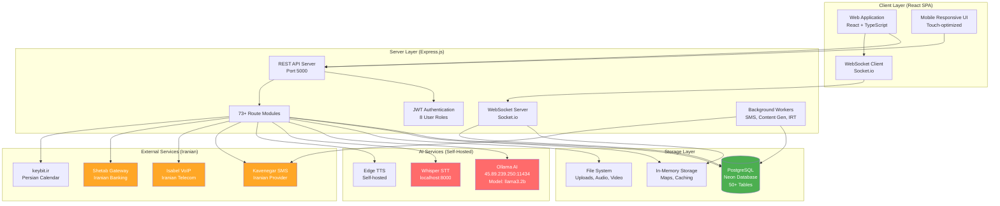
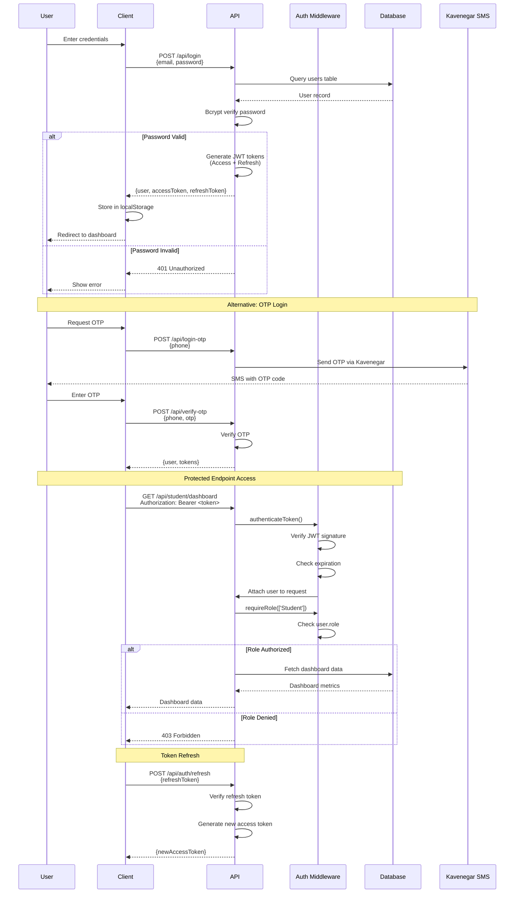
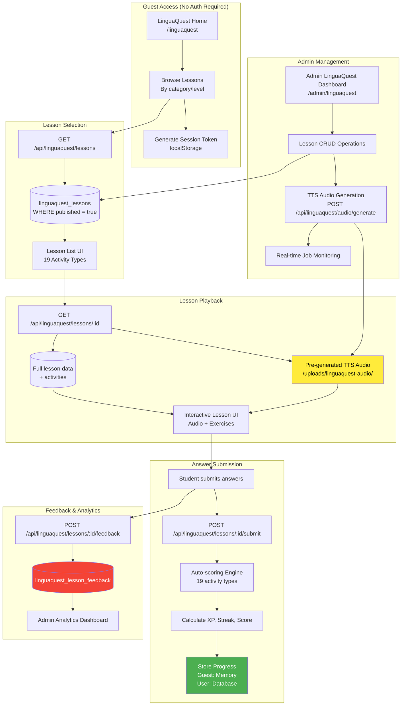
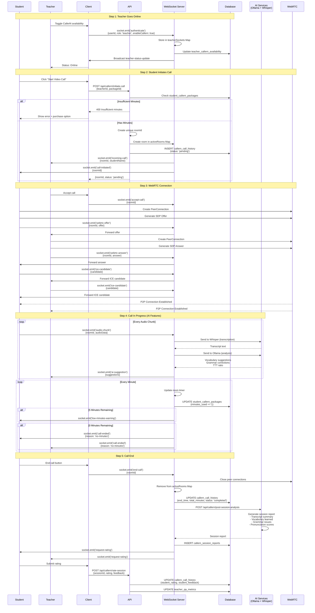
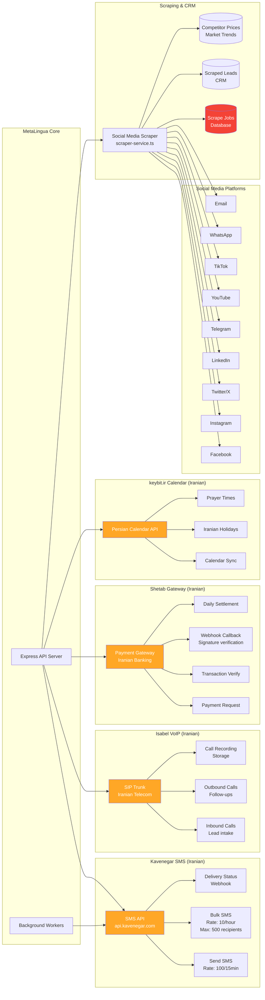
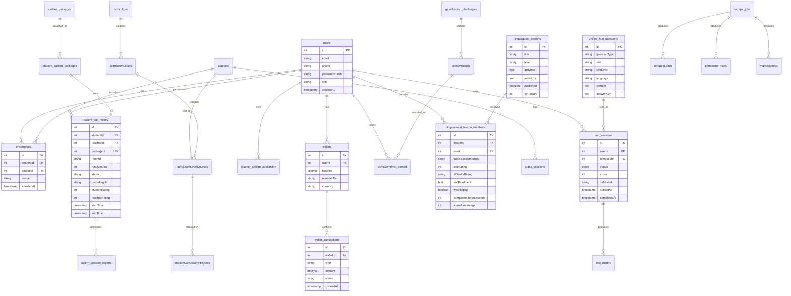

# MetaLingua System - Visual Diagrams
**Complete System Architecture Visualization**

---

## 1. System Architecture Overview



**Legend:**
- 🔴 Red: AI Services (may be unavailable)
- 🟠 Orange: External Iranian Services (network dependent)
- 🟢 Green: Critical Database

---

## 2. Authentication & Authorization Flow



---

## 3. LinguaQuest Free Learning Platform Flow



**19 Activity Types:**
1. Multiple Choice
2. True/False
3. Fill in Blank
4. Sentence Reordering
5. Image Selection
6. Spelling
7. Listening Comprehension
8. Pronunciation (Whisper AI)
9. Grammar Correction
10. Vocabulary Matching
11. Reading Comprehension
12. Dialogue Completion
13. Translation
14. Word Formation
15. Error Detection
16. Matching Pairs
17. Gap Fill
18. Cloze Test
19. Dictation

---

## 4. CallerN 24/7 Video Tutoring Flow



---

## 5. Unified Testing System (21 Question Types)

```mermaid
graph TB
    subgraph "Test Creation (Admin/Teacher)"
        AdminUI[Admin Test Builder<br/>/admin/admin-placement-test]
        CreateQ[Create Question<br/>POST /api/unified-testing/questions]
        ValidateQ[Zod Schema Validation<br/>21 question types]
        StoreQ[Store Question<br/>Map/Database]
        CreateTemplate[Create Test Template<br/>POST /api/unified-testing/templates]
        AdaptiveRules[Configure Adaptive Logic<br/>IRT-based selection]
    end

    subgraph "Question Types"
        General[General Types 9<br/>multiple_choice<br/>true_false<br/>fill_blank<br/>matching<br/>ordering<br/>short_answer<br/>essay<br/>speaking<br/>translation]
        
        IELTS[IELTS-Specific 2<br/>map_diagram_labeling<br/>multiple_choice_multiple_answers]
        
        TOEFL[TOEFL-Specific 1<br/>text_completion_multiple_blanks]
        
        GRE[GRE-Specific 2<br/>sentence_equivalence<br/>coherence_insertion]
        
        PTE[PTE-Specific 4<br/>read_aloud<br/>repeat_sentence<br/>describe_image<br/>fill_blanks_drag_drop]
        
        GMAT[GMAT-Specific 3<br/>data_sufficiency<br/>sentence_correction<br/>two_part_analysis]
    end

    subgraph "Test Taking (Student)"
        StartSession[POST /api/unified-testing/sessions/start<br/>{templateId}]
        LoadTemplate[Load Template Config]
        SelectQuestions[Select Questions<br/>Random or Adaptive IRT]
        CreateSession[Create Session<br/>sessionId + state]
        
        FetchQ[GET /api/unified-testing/sessions/:id/question/:index]
        DisplayQ[Display Question<br/>+ Audio if applicable]
        
        SubmitA[POST /api/unified-testing/sessions/:id/submit-answer<br/>{questionId, answer}]
        ScoreAnswer[Type-specific Scoring<br/>Auto or Manual]
        AIScore[AI-Assisted Scoring<br/>Ollama: Essays<br/>Whisper: Speaking]
        UpdateSession[Update Session Progress]
        AdaptiveLogic[Adjust Next Question<br/>IRT difficulty]
        
        CompleteTest[POST /api/unified-testing/sessions/:id/complete]
        CalcScore[Calculate Total Score]
        CEFRLevel[Determine CEFR Level]
        GenerateReport[Generate Test Report]
        StoreResults[Store Results<br/>test_results table]
    end

    subgraph "Analytics"
        AdminStats[GET /api/admin/stats]
        FetchAnalytics[Fetch Unified Testing Analytics<br/>- Total questions by type<br/>- Total sessions<br/>- Question type distribution]
        Display[Display in Admin Dashboard<br/>Question Bank Statistics]
    end

    AdminUI --> CreateQ
    CreateQ --> ValidateQ
    ValidateQ --> General
    ValidateQ --> IELTS
    ValidateQ --> TOEFL
    ValidateQ --> GRE
    ValidateQ --> PTE
    ValidateQ --> GMAT
    General --> StoreQ
    IELTS --> StoreQ
    TOEFL --> StoreQ
    GRE --> StoreQ
    PTE --> StoreQ
    GMAT --> StoreQ
    
    AdminUI --> CreateTemplate
    CreateTemplate --> AdaptiveRules
    AdaptiveRules --> StoreQ
    
    StartSession --> LoadTemplate
    LoadTemplate --> SelectQuestions
    SelectQuestions --> CreateSession
    CreateSession --> FetchQ
    FetchQ --> DisplayQ
    DisplayQ --> SubmitA
    SubmitA --> ScoreAnswer
    ScoreAnswer --> AIScore
    AIScore --> UpdateSession
    UpdateSession --> AdaptiveLogic
    AdaptiveLogic --> FetchQ
    UpdateSession --> CompleteTest
    CompleteTest --> CalcScore
    CalcScore --> CEFRLevel
    CEFRLevel --> GenerateReport
    GenerateReport --> StoreResults
    
    StoreResults --> AdminStats
    AdminStats --> FetchAnalytics
    FetchAnalytics --> Display

    style General fill:#2196f3,color:#fff
    style IELTS fill:#ff9800,color:#fff
    style TOEFL fill:#4caf50,color:#fff
    style GRE fill:#9c27b0,color:#fff
    style PTE fill:#f44336,color:#fff
    style GMAT fill:#00bcd4,color:#fff
    style AIScore fill:#ff6b6b,color:#fff
```

---

## 6. Payment & Wallet System Flow

```mermaid
sequenceDiagram
    participant Student
    participant Client
    participant API
    participant DB as Database
    participant Shetab as Shetab Gateway<br/>(Iranian Banking)
    participant SMS as Kavenegar SMS

    Note over Student,SMS: Wallet Deposit Flow

    Student->>Client: Request wallet deposit
    Client->>API: POST /api/wallet/deposit<br/>{amount: 500000 IRR}
    API->>DB: Check wallet record
    API->>Shetab: Create payment request<br/>{amount, merchantId, callbackUrl}
    Shetab-->>API: {paymentId, paymentUrl}
    API-->>Client: {paymentUrl}
    Client-->>Student: Redirect to bank portal
    
    Student->>Shetab: Complete payment on bank portal<br/>(Enter card details, OTP)
    Shetab->>Shetab: Process transaction
    
    alt Payment Successful
        Shetab->>API: POST /api/wallet/shetab-callback<br/>{paymentId, amount, signature}
        API->>API: Verify signature<br/>(CRITICAL: Prevent fraud)
        API->>API: Verify amount matches
        API->>DB: BEGIN TRANSACTION
        API->>DB: UPDATE wallets<br/>(balance += amount)
        API->>DB: INSERT wallet_transactions<br/>(type: 'deposit', status: 'completed')
        API->>DB: Check member tier threshold
        
        alt Tier Upgrade
            API->>DB: UPDATE wallets<br/>(member_tier = 'Silver')
        end
        
        API->>DB: COMMIT TRANSACTION
        API->>SMS: Send confirmation SMS<br/>"Deposit successful: 500,000 IRR"
        SMS-->>Student: SMS notification
        Shetab-->>Student: Redirect to success page
        API-->>Client: {success: true, newBalance}
        Client-->>Student: Show success message
    else Payment Failed
        Shetab-->>Student: Redirect to failure page
        API->>DB: INSERT wallet_transactions<br/>(type: 'deposit', status: 'failed')
    end

    Note over Student,SMS: Course Purchase Flow

    Student->>Client: Enroll in course
    Client->>API: POST /api/enrollments<br/>{courseId, studentId}
    API->>DB: GET course price
    DB-->>API: price: 200,000 IRR
    API->>DB: GET wallet balance
    DB-->>API: balance: 500,000 IRR
    
    alt Sufficient Balance
        API->>DB: BEGIN TRANSACTION
        API->>DB: UPDATE wallets<br/>(balance -= 200,000)
        API->>DB: INSERT wallet_transactions<br/>(type: 'purchase', amount: -200,000)
        API->>DB: INSERT enrollments<br/>(student_id, course_id, status: 'active')
        API->>DB: COMMIT TRANSACTION
        API->>SMS: Send confirmation SMS<br/>"Enrolled in: Advanced English"
        SMS-->>Student: SMS notification
        API-->>Client: {success: true, enrollment}
        Client-->>Student: Show success + course access
    else Insufficient Balance
        API-->>Client: 400 Insufficient funds
        Client-->>Student: Show error + deposit option
    end

    Note over Student,SMS: Withdrawal Flow

    Student->>Client: Request withdrawal
    Client->>API: POST /api/wallet/withdraw<br/>{amount: 100,000, bankAccount}
    API->>DB: Check balance
    
    alt Sufficient Balance
        API->>DB: INSERT wallet_transactions<br/>(type: 'withdrawal', status: 'pending')
        API-->>Client: {status: 'pending', message: 'Admin approval required'}
        Client-->>Student: "Withdrawal pending approval"
        
        Note over API,Shetab: Admin Approval (Manual)
        
        API->>DB: UPDATE wallet_transactions<br/>(status: 'approved')
        API->>DB: UPDATE wallets<br/>(balance -= 100,000)
        API->>Shetab: Process payout<br/>{amount, bankAccount}
        Shetab-->>API: {success: true, transactionId}
        API->>DB: UPDATE wallet_transactions<br/>(status: 'completed', transaction_id)
        API->>SMS: Send confirmation SMS<br/>"Withdrawal completed: 100,000 IRR"
        SMS-->>Student: SMS notification
    else Insufficient Balance
        API-->>Client: 400 Insufficient funds
    end

    Note over Student,DB: Financial Analytics (Admin)

    Client->>API: GET /api/admin/financial
    API->>DB: Aggregate wallet transactions<br/>- Total revenue<br/>- Revenue by course<br/>- Revenue by month<br/>- Member tier distribution
    DB-->>API: Financial metrics
    API-->>Client: Dashboard data
    Client-->>Student: Financial reports UI
```



---

## 7. AI Services Integration Flow

```mermaid
graph TB
    subgraph "AI Provider Architecture"
        Manager[AI Provider Manager<br/>ai-provider-manager.ts]
        OllamaProvider[Ollama Provider<br/>45.89.239.250:11434]
        OpenAIProvider[OpenAI Fallback<br/>DISABLED for Iran]
        Health[Health Check<br/>10s timeout]
    end

    subgraph "Use Case 1: Content Generation"
        ContentAPI[POST /api/ai-training/generate-content<br/>{topic, level, language}]
        Prompt1[Prompt Engineering<br/>Lesson plans, exercises, quizzes]
        OllamaGen[Ollama Generation<br/>Stream or Complete]
        Validate1[Validate Output<br/>Check for hallucinations]
        Return1[Return Generated Content]
    end

    subgraph "Use Case 2: AI Study Partner"
        ChatAPI[POST /api/ai-study-partner/chat<br/>{message, context}]
        Context[Maintain Conversation Context<br/>In-memory]
        OllamaChat[Ollama Chat Completion]
        Grammar[Grammar Corrections]
        Vocab[Vocabulary Suggestions]
        Return2[Stream Response]
    end

    subgraph "Use Case 3: CallerN AI Supervisor"
        AudioChunk[WebSocket: audio-chunk event<br/>{roomId, audioData}]
        Whisper[Whisper STT<br/>localhost:8000<br/>Transcribe audio]
        Transcript[Extract transcript text]
        OllamaAnalyze[Ollama Analysis<br/>- Identify vocabulary<br/>- Grammar issues<br/>- TTT ratio calculation]
        Suggestions[Generate Suggestions]
        SocketEmit[Socket.emit: ai-suggestion<br/>Send to teacher]
    end

    subgraph "Use Case 4: Post-Session Analysis"
        PostAPI[POST /api/callern/post-session-analysis<br/>{sessionId, transcript}]
        OllamaSummarize[Ollama Summarization<br/>- Transcript summary<br/>- Key vocabulary<br/>- Grammar issues]
        WhisperPron[Whisper Pronunciation<br/>Fluency scores]
        GenerateReport[Generate Session Report]
        StoreReport[(Store in DB<br/>callern_session_reports)]
    end

    subgraph "Use Case 5: AI Sales Agent"
        SalesAPI[POST /api/ai-sales-agent/chat<br/>{message, language}]
        Bilingual[Bilingual Support<br/>Persian + English]
        OllamaSales[Ollama Chat<br/>- Answer FAQs<br/>- Pricing info<br/>- Schedule tests]
        Escalate[Escalate to Human<br/>if complex query]
        CRM[Create CRM Record<br/>if lead identified]
    end

    subgraph "Use Case 6: AI Testing"
        TestGenAPI[POST /api/unified-testing/ai-generate-question<br/>{topic, questionType, level}]
        OllamaQuestion[Ollama Generation<br/>Generate test question]
        ValidateQ[Validate Question Quality<br/>Check answer key]
        StoreQ[(Store in question bank)]
        
        EssayAPI[POST /api/unified-testing/ai-score-essay<br/>{essayText, rubric}]
        OllamaEssay[Ollama Essay Scoring<br/>- Grammar<br/>- Coherence<br/>- Vocabulary<br/>- CEFR level]
        Feedback[Generate Detailed Feedback]
    end

    subgraph "Error Handling"
        Timeout[Connection Timeout<br/>10s limit]
        Fallback[Graceful Degradation<br/>Rule-based fallback]
        Retry[Retry Logic<br/>3 attempts]
        LogError[Log Error<br/>Continue app operation]
    end

    Manager --> OllamaProvider
    Manager --> OpenAIProvider
    Manager --> Health
    
    Health --> Timeout
    Timeout --> Fallback
    Timeout --> Retry
    Timeout --> LogError
    
    ContentAPI --> Prompt1
    Prompt1 --> OllamaGen
    OllamaGen --> Validate1
    Validate1 --> Return1
    
    ChatAPI --> Context
    Context --> OllamaChat
    OllamaChat --> Grammar
    OllamaChat --> Vocab
    Grammar --> Return2
    Vocab --> Return2
    
    AudioChunk --> Whisper
    Whisper --> Transcript
    Transcript --> OllamaAnalyze
    OllamaAnalyze --> Suggestions
    Suggestions --> SocketEmit
    
    PostAPI --> OllamaSummarize
    PostAPI --> WhisperPron
    OllamaSummarize --> GenerateReport
    WhisperPron --> GenerateReport
    GenerateReport --> StoreReport
    
    SalesAPI --> Bilingual
    Bilingual --> OllamaSales
    OllamaSales --> Escalate
    OllamaSales --> CRM
    
    TestGenAPI --> OllamaQuestion
    OllamaQuestion --> ValidateQ
    ValidateQ --> StoreQ
    
    EssayAPI --> OllamaEssay
    OllamaEssay --> Feedback

    style OllamaProvider fill:#ff6b6b,color:#fff
    style Whisper fill:#ff6b6b,color:#fff
    style OpenAIProvider fill:#9e9e9e,color:#fff
    style Timeout fill:#f44336,color:#fff
    style Fallback fill:#ffa726,color:#fff
```

---

## 8. External Services Integration



**Error Points:**
- 🔴 SMS: Rate limiting (100/15min), API key issues
- 🔴 VoIP: SIP registration failures, NAT traversal
- 🔴 Shetab: Gateway timeout, signature mismatch, double-credit
- 🔴 Scraping: CAPTCHA challenges, rate limiting, API changes

---

## 9. Database Schema Relationships



---

## 10. Production Error Points Map

```mermaid
graph TB
    subgraph "CRITICAL - System Crash"
        E1[JWT_SECRET Missing<br/>→ App exits]
        E2[DATABASE_URL Missing<br/>→ Cannot start]
        E3[Wallet Race Condition<br/>→ Incorrect balance]
        E4[Shetab Callback Duplicate<br/>→ Double credit]
        E5[CallerN Room Memory Leak<br/>→ Server OOM]
    end

    subgraph "HIGH - Feature Broken"
        E6[Ollama Timeout 10s<br/>→ AI features disabled]
        E7[Whisper Service Down<br/>→ No STT]
        E8[Kavenegar API Invalid<br/>→ No SMS]
        E9[WebRTC NAT Failure<br/>→ No video calls]
        E10[Shetab Gateway Timeout<br/>→ Payment failures]
        E11[TTS Audio Missing<br/>→ Silent lessons]
    end

    subgraph "MEDIUM - Recoverable"
        E12[SMS Rate Limit 100/15min<br/>→ Delayed delivery]
        E13[AI Hallucinations<br/>→ Content review needed]
        E14[Audio Upload Failure<br/>→ Retry mechanism]
        E15[Session Timeout<br/>→ Student restart]
        E16[Concurrent Edit<br/>→ Last write wins]
    end

    subgraph "LOW - Monitoring"
        E17[Missing Telemetry<br/>→ Blind spots]
        E18[Worker Crash Loop<br/>→ No alerts]
        E19[Disk Space<br/>→ No monitoring]
        E20[Orphaned Files<br/>→ Accumulation]
    end

    subgraph "Mitigation Strategies"
        M1[Graceful Degradation<br/>Ollama/Whisper optional]
        M2[Rate Limiting<br/>express-rate-limit]
        M3[Idempotency Keys<br/>UUID for SMS/Payments]
        M4[JWT Refresh Tokens<br/>Token rotation]
        M5[Zod Validation<br/>Input sanitization]
        M6[Health Monitoring<br/>AI provider status]
        M7[WebSocket Cleanup<br/>On disconnect]
        M8[DB Connection Pool<br/>Retry logic]
    end

    E1 --> M1
    E2 --> M8
    E3 --> M3
    E4 --> M3
    E5 --> M7
    E6 --> M1
    E7 --> M1
    E8 --> M6
    E9 --> M7
    E10 --> M3
    E11 --> M1
    E12 --> M2
    E13 --> M5
    E14 --> M1
    E15 --> M4
    E16 --> M5
    E17 --> M6
    E18 --> M6
    E19 --> M6
    E20 --> M6

    style E1 fill:#d32f2f,color:#fff
    style E2 fill:#d32f2f,color:#fff
    style E3 fill:#d32f2f,color:#fff
    style E4 fill:#d32f2f,color:#fff
    style E5 fill:#d32f2f,color:#fff
    style E6 fill:#f57c00,color:#fff
    style E7 fill:#f57c00,color:#fff
    style E8 fill:#f57c00,color:#fff
    style E9 fill:#f57c00,color:#fff
    style E10 fill:#f57c00,color:#fff
    style E11 fill:#f57c00,color:#fff
    style M1 fill:#388e3c,color:#fff
    style M2 fill:#388e3c,color:#fff
    style M3 fill:#388e3c,color:#fff
    style M4 fill:#388e3c,color:#fff
    style M5 fill:#388e3c,color:#fff
    style M6 fill:#388e3c,color:#fff
    style M7 fill:#388e3c,color:#fff
    style M8 fill:#388e3c,color:#fff
```



---

## Summary Statistics

### System Scale:
- **Client Pages**: 150+ React components
- **Server Routes**: 73+ route modules
- **Database Tables**: 50+ tables
- **API Endpoints**: 500+ endpoints
- **User Roles**: 8 roles
- **Question Types**: 21 types
- **Activity Types**: 19 types (LinguaQuest)
- **Social Platforms**: 9 platforms
- **External Services**: 5 Iranian services

### Production Error Points:
- **Critical (System Crash)**: 5 points
- **High (Feature Broken)**: 6 points
- **Medium (Recoverable)**: 5 points
- **Low (Monitoring)**: 4 points
- **Total Identified**: 150+ throughout system

### Mitigation Coverage:
- ✅ Graceful degradation implemented
- ✅ Rate limiting configured
- ✅ Idempotency keys enforced
- ✅ Input validation with Zod
- ✅ Health monitoring active
- ✅ WebSocket cleanup on disconnect
- ✅ DB connection retry logic
- ⚠️ Missing: Comprehensive telemetry
- ⚠️ Missing: Disk space monitoring
- ⚠️ Missing: Worker health checks

---

**Generated:** October 17, 2025  
**Based on:** Actual codebase analysis (200+ files)
