# Meta Lingua Platform - Complete Workflow Diagrams

## Table of Contents
1. [Authentication & Role Management](#authentication--role-management)
2. [Student Workflows](#student-workflows) 
3. [Teacher Workflows](#teacher-workflows)
4. [Admin Workflows](#admin-workflows)
5. [Call Center Workflows](#call-center-workflows)
6. [Supervisor Workflows](#supervisor-workflows)
7. [Mentor Workflows](#mentor-workflows)
8. [Accountant Workflows](#accountant-workflows)
9. [Core System Workflows](#core-system-workflows)

---

## 1. Authentication & Role Management

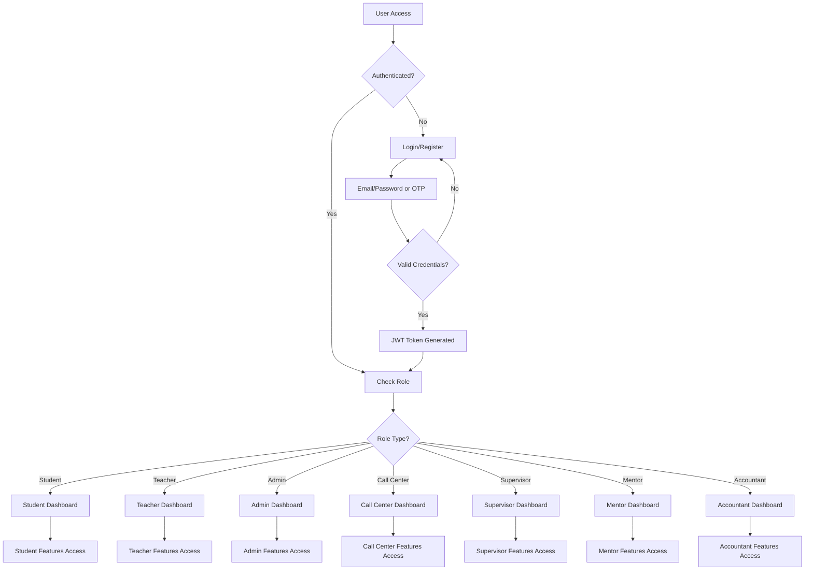

---

## 2. Student Workflows

### 2.1 Student Registration & Onboarding
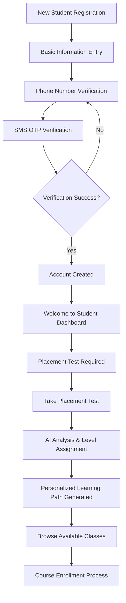

### 2.2 Student Learning Journey
```mermaid
graph TD
    A[Student Dashboard] --> B{Action Type?}
    
    B -->|Browse Courses| C[View Available Classes]
    B -->|Take Test| D[Placement Test Flow]
    B -->|Study| E[Learning Activities]
    B -->|Practice| F[CallCrn Video Sessions]
    B -->|Payment| G[Wallet Management]
    
    C --> H[Filter by Language/Level]
    H --> I[View Course Details]
    I --> J{Enroll?}
    J -->|Yes| K[Check Wallet Balance]
    J -->|No| C
    K --> L{Sufficient Funds?}
    L -->|No| M[Add Funds to Wallet]
    L -->|Yes| N[Enrollment Confirmed]
    
    D --> O[Smart Assessment (10 min, 7 questions)]
    O --> P[AI Level Analysis]
    P --> Q[Personalized Roadmap Created]
    
    E --> R[Interactive Lessons]
    R --> S[Homework Assignments]
    S --> T[Progress Tracking]
    T --> U[XP & Gamification]
    
    F --> V[Find Available Teachers]
    V --> W[Video Call Session]
    W --> X[AI-Powered Assistance]
    X --> Y[Session Recording & Analysis]
    
    G --> Z[IRR Wallet System]
    Z --> AA[Shetab Payment Gateway]
    AA --> BB[Transaction History]
```

### 2.3 Student Class Participation
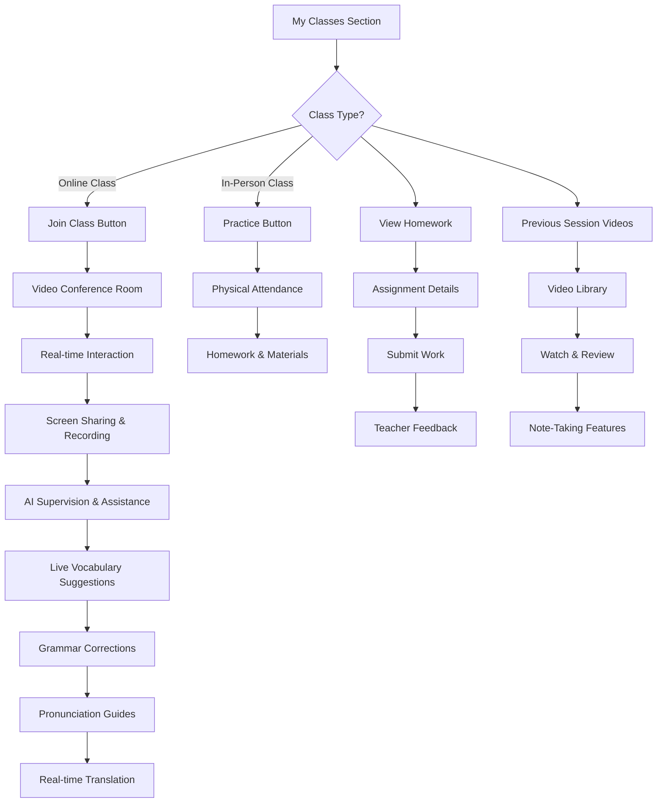

---

## 3. Teacher Workflows

### 3.1 Teacher Registration & Setup
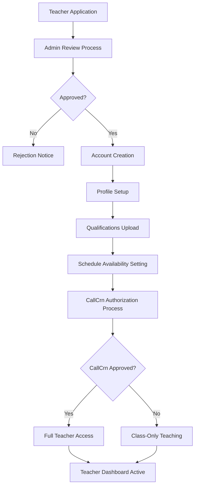

### 3.2 Teacher Class Management
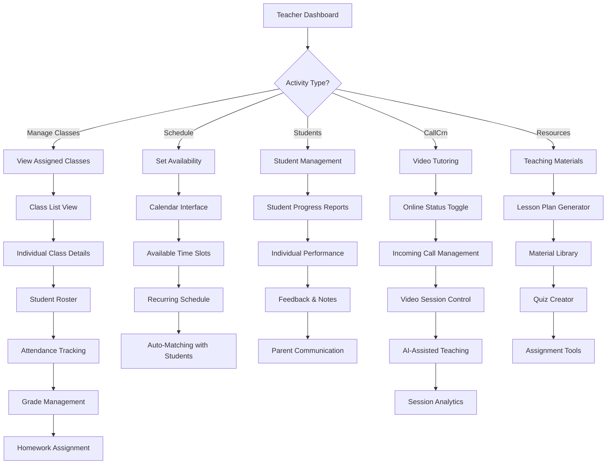

### 3.3 Teacher CallCrn Video Sessions
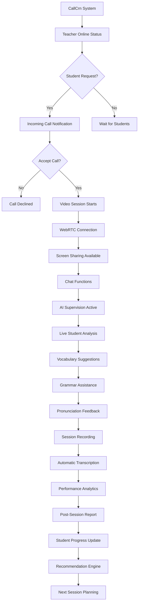

---

## 4. Admin Workflows

### 4.1 Admin System Management
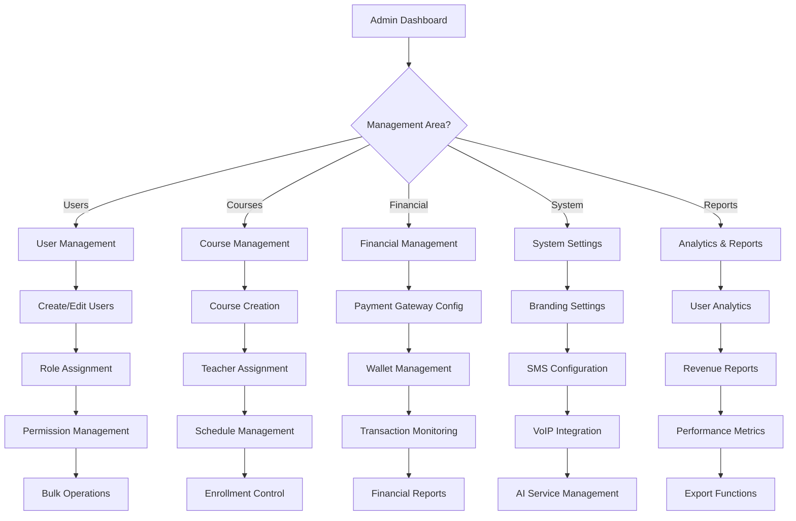

### 4.2 Admin Course & Class Creation
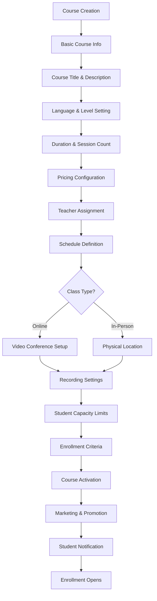

### 4.3 Admin CRM & Lead Management
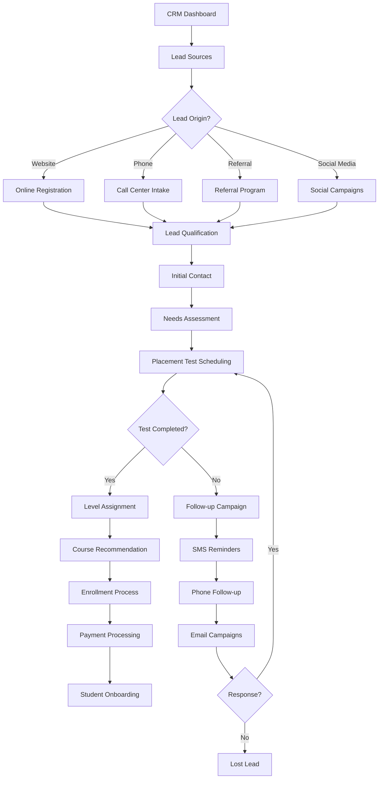

---

## 5. Call Center Workflows

### 5.1 Call Center Lead Processing
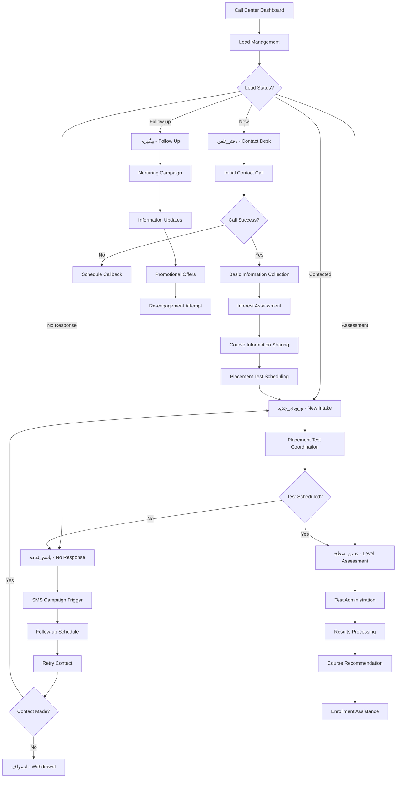

### 5.2 Call Center VoIP Integration
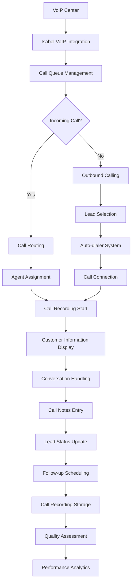

---

## 6. Supervisor Workflows

### 6.1 Supervisor Monitoring
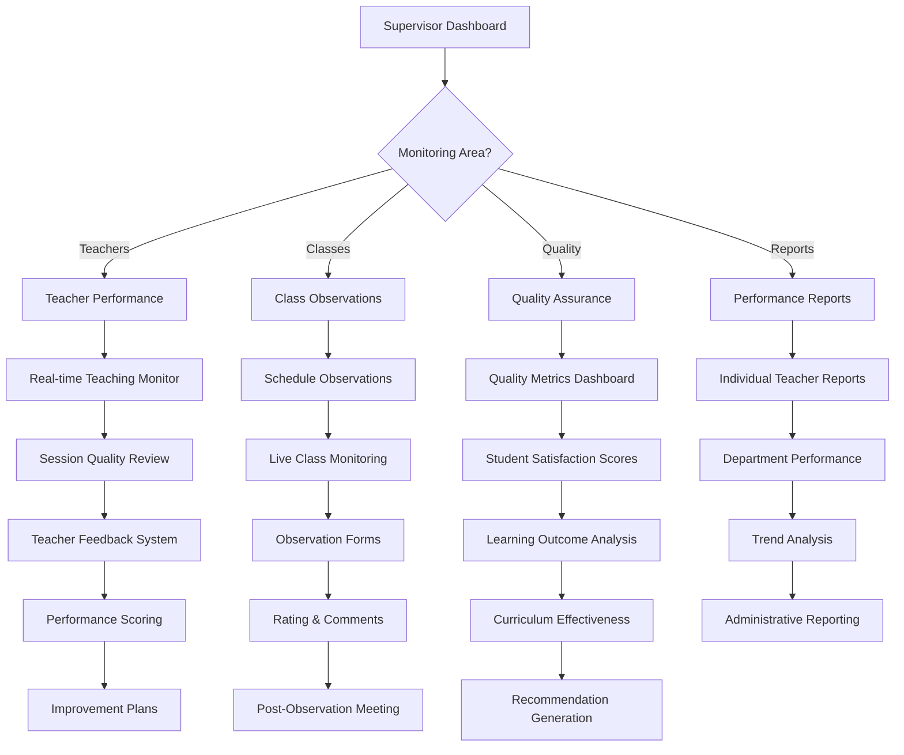

### 6.2 Supervisor Quality Control
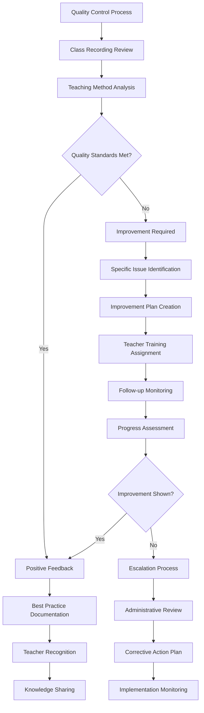

---

## 7. Mentor Workflows

### 7.1 Mentor Student Support
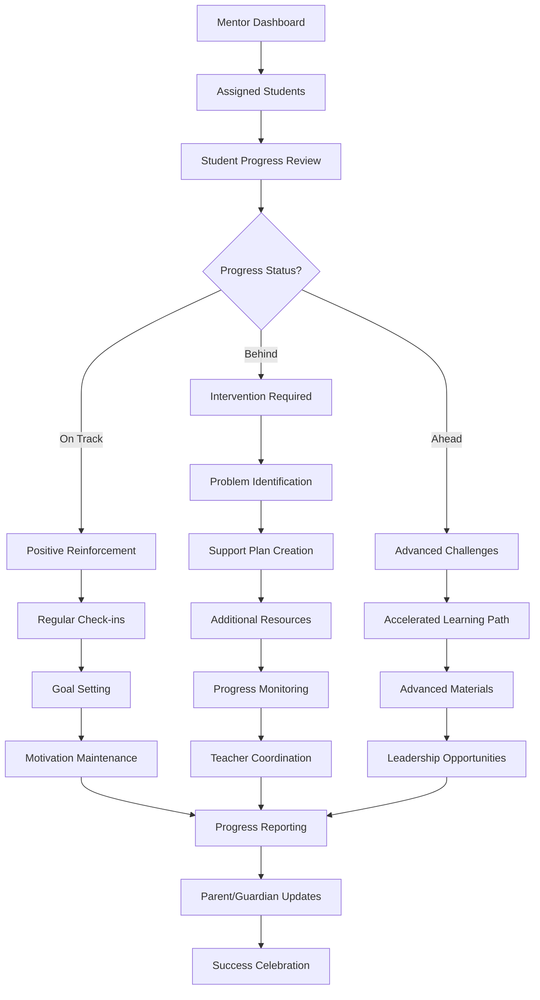

### 7.2 Mentor Communication System
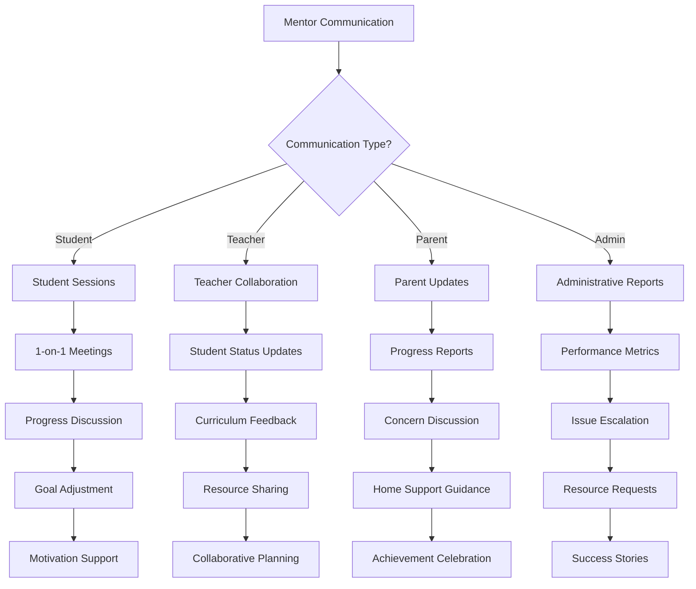

---

## 8. Accountant Workflows

### 8.1 Financial Management
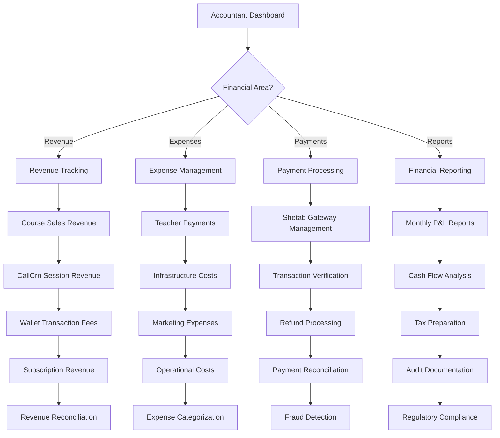

### 8.2 Teacher Payment System
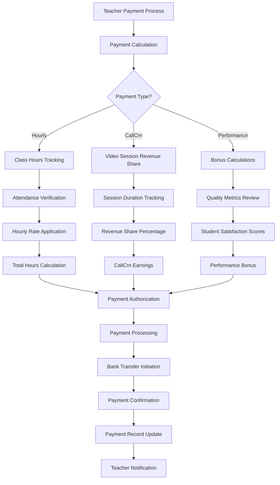

---

## 9. Core System Workflows

### 9.1 CallCrn Video System
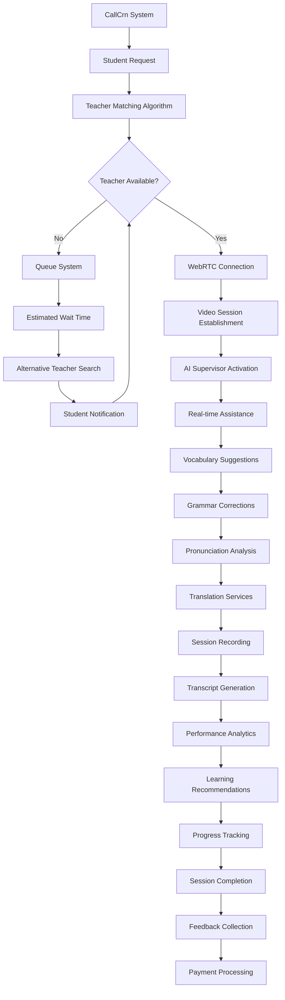

### 9.2 AI-Powered Learning System
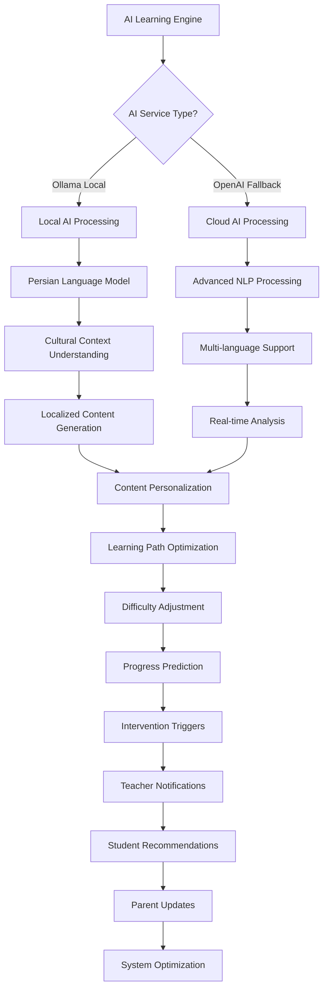

### 9.3 Gamification System
```mermaid
graph TD
    A[Gamification Engine] --> B[Activity Tracking]
    B --> C{Activity Type?}
    
    C -->|Lesson Completion| D[XP Award Calculation]
    C -->|Homework Submission| E[Achievement Unlock]
    C -->|Perfect Attendance| F[Streak Maintenance]
    C -->|Test Performance| G[Level Progression]
    
    D --> H[Base XP + Bonus Multipliers]
    H --> I[Level Threshold Check]
    I --> J{Level Up?}
    J -->|Yes| K[Celebration Animation]
    J -->|No| L[Progress Bar Update]
    
    E --> M[Badge System]
    M --> N[Achievement Categories]
    N --> O[Social Sharing Options]
    
    F --> P[Daily Challenge System]
    P --> Q[Streak Rewards]
    Q --> R[Motivation Boosts]
    
    G --> S[Skill Tree Progression]
    S --> T[New Content Unlocks]
    T --> U[Advanced Challenges]
    
    K --> V[Leaderboard Updates]
    L --> V
    O --> V
    R --> V
    U --> V
    
    V --> W[Social Competition]
    W --> X[Team Battles]
    X --> Y[Peer Motivation]
```

### 9.4 SMS & Communication System
```mermaid
graph TD
    A[Communication Center] --> B{Message Type?}
    
    B -->|SMS| C[Kavenegar SMS Service]
    B -->|Email| D[Email Service]
    B -->|Push| E[Push Notifications]
    B -->|In-App| F[Internal Messaging]
    
    C --> G[SMS Templates]
    G --> H[Personalization Engine]
    H --> I[Iranian Phone Numbers]
    I --> J[Delivery Confirmation]
    
    D --> K[Email Templates]
    K --> L[Multi-language Support]
    L --> M[SMTP Configuration]
    M --> N[Delivery Tracking]
    
    E --> O[Device Registration]
    O --> P[Notification Targeting]
    P --> Q[Real-time Delivery]
    
    F --> R[Chat System]
    R --> S[File Sharing]
    S --> T[Message History]
    
    J --> U[Analytics Dashboard]
    N --> U
    Q --> U
    T --> U
    
    U --> V[Communication Effectiveness]
    V --> W[Engagement Metrics]
    W --> X[Campaign Optimization]
```

### 9.5 Payment & Wallet System
```mermaid
graph TD
    A[Payment System] --> B[Iranian Rial (IRR) Wallet]
    B --> C{Transaction Type?}
    
    C -->|Deposit| D[Shetab Payment Gateway]
    C -->|Course Payment| E[Course Enrollment]
    C -->|CallCrn Payment| F[Video Session Payment]
    C -->|Withdrawal| G[Bank Transfer]
    
    D --> H[Bank Card Verification]
    H --> I[Secure Payment Processing]
    I --> J[Transaction Confirmation]
    J --> K[Wallet Balance Update]
    
    E --> L[Course Price Deduction]
    L --> M[Enrollment Confirmation]
    M --> N[Receipt Generation]
    
    F --> O[Per-minute Billing]
    O --> P[Real-time Deduction]
    P --> Q[Session Continuation Check]
    
    G --> R[Withdrawal Request]
    R --> S[Identity Verification]
    S --> T[Bank Transfer Processing]
    
    K --> U[Transaction History]
    N --> U
    Q --> U
    T --> U
    
    U --> V[Financial Reporting]
    V --> W[Audit Trail]
    W --> X[Compliance Monitoring]
```

---

## Summary

This comprehensive workflow documentation covers all 7 user roles and core systems in the Meta Lingua platform:

**User Roles Covered:**
- Students: Registration, learning journey, class participation
- Teachers: Setup, class management, CallCrn sessions  
- Admins: System management, course creation, CRM
- Call Center: Lead processing, VoIP integration
- Supervisors: Quality monitoring, performance management
- Mentors: Student support, communication
- Accountants: Financial management, payment processing

**Core Systems Covered:**
- Authentication & role-based access
- CallCrn video tutoring system
- AI-powered learning engine
- Gamification & motivation system
- SMS & communication center
- Payment & wallet system (Iranian compliance)

Each workflow shows the complete user journey from initial interaction through task completion, including decision points, error handling, and system integrations.